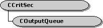

# COutputQueue class

\[The feature associated with this page, [DirectShow](/windows/win32/directshow/directshow), is a legacy feature. It has been superseded by [MediaPlayer](/uwp/api/Windows.Media.Playback.MediaPlayer), [IMFMediaEngine](/windows/win32/api/mfmediaengine/nn-mfmediaengine-imfmediaengine), and [Audio/Video Capture in Media Foundation](windows/win32/medfound/audio-video-capture-in-media-foundation). Those features have been optimized for Windows 10 and Windows 11. Microsoft strongly recommends that new code use **MediaPlayer**, **IMFMediaEngine** and **Audio/Video Capture in Media Foundation** instead of **DirectShow**, when possible. Microsoft suggests that existing code that uses the legacy APIs be rewritten to use the new APIs if possible.\]

The `COutputQueue` class implements a queue to deliver media samples.

This class enables an output pin to deliver samples asynchronously. Samples are placed on a queue, and a worker thread delivers them to the input pin. The queue can also hold control messages that indicate a new segment, an end-of-stream notification, or a flush operation.

To use this class, create a **COutputQueue** object for every output pin on the filter. In the constructor method, specify the input pin connected to that output pin. Using this class, the output pin does not call methods directly on the input pin. Instead, it calls corresponding methods in `COutputQueue`, as shown in the following table.

| Pin Method                                                            | COutputQueue Method                                     |
|-----------------------------------------------------------------------|---------------------------------------------------------|
| [**IPin::BeginFlush**](/windows/desktop/api/Strmif/nf-strmif-ipin-beginflush)                           | [**BeginFlush**](coutputqueue-beginflush.md)           |
| [**IPin::EndFlush**](/windows/desktop/api/Strmif/nf-strmif-ipin-endflush)                               | [**EndFlush**](coutputqueue-endflush.md)               |
| [**IPin::EndOfStream**](/windows/desktop/api/Strmif/nf-strmif-ipin-endofstream)                         | [**EOS**](coutputqueue-eos.md)                         |
| [**IPin::NewSegment**](/windows/desktop/api/Strmif/nf-strmif-ipin-newsegment)                           | [**NewSegment**](coutputqueue-newsegment.md)           |
| [**IMemInputPin::Receive**](/windows/desktop/api/Strmif/nf-strmif-imeminputpin-receive)                 | [**Receive**](coutputqueue-receive.md)                 |
| [**IMemInputPin::ReceiveMultiple**](/windows/desktop/api/Strmif/nf-strmif-imeminputpin-receivemultiple) | [**ReceiveMultiple**](coutputqueue-receivemultiple.md) |

 

Optionally, you can configure the `COutputQueue` object to deliver samples synchronously, without a worker thread. The object can also decide at run time whether to use a worker thread, based on the characteristics of the input pin. For more information, see [**COutputQueue::COutputQueue**](coutputqueue-coutputqueue.md).

| Protected Member Variables                                   | Description                                                                                              |
|--------------------------------------------------------------|----------------------------------------------------------------------------------------------------------|
| [**m\_pPin**](coutputqueue-m-ppin.md)                       | Pointer to the input pin's [**IPin**](/windows/desktop/api/Strmif/nn-strmif-ipin) interface.                                               |
| [**m\_pInputPin**](coutputqueue-m-pinputpin.md)             | Pointer to the input pin's [**IMemInputPin**](/windows/desktop/api/Strmif/nn-strmif-imeminputpin) interface.                               |
| [**m\_bBatchExact**](coutputqueue-m-bbatchexact.md)         | Flag that specifies whether the object delivers samples in exact batches.                                |
| [**m\_lBatchSize**](coutputqueue-m-lbatchsize.md)           | Batch size.                                                                                              |
| [**m\_List**](coutputqueue-m-list.md)                       | Media sample queue.                                                                                      |
| [**m\_hSem**](coutputqueue-m-hsem.md)                       | Handle to a semaphore, used by the thread to wait for samples.                                           |
| [**m\_evFlushComplete**](coutputqueue-m-evflushcomplete.md) | Event that signals when a flush operation has finished.                                                  |
| [**m\_hThread**](coutputqueue-m-hthread.md)                 | Handle to the worker thread.                                                                             |
| [**m\_ppSamples**](coutputqueue-m-ppsamples.md)             | Array of samples of size [**COutputQueue::m\_lBatchSize**](coutputqueue-m-lbatchsize.md).               |
| [**m\_nBatched**](coutputqueue-m-nbatched.md)               | Number of samples currently batched and awaiting processing.                                             |
| [**m\_lWaiting**](coutputqueue-m-lwaiting.md)               | Flag that has a nonzero value when the thread is waiting for a sample.                                   |
| [**m\_bFlushing**](coutputqueue-m-bflushing.md)             | Flag that specifies whether the object is performing a flush operation.                                  |
| [**m\_bTerminate**](coutputqueue-m-bterminate.md)           | Flag that specifies whether the thread should terminate.                                                 |
| [**m\_bSendAnyway**](coutputqueue-m-bsendanyway.md)         | Flag to override batch processing.                                                                       |
| [**m\_hr**](coutputqueue-m-hr.md)                           | **HRESULT** value that indicates whether the object will accept samples.                                 |
| [**m\_hEventPop**](coutputqueue-m-heventpop.md)             | Event that is signaled whenever the object removes a sample from the queue.                              |
| Protected Methods                                            | Description                                                                                              |
| [**InitialThreadProc**](coutputqueue-initialthreadproc.md)  | Calls the [**COutputQueue::ThreadProc**](coutputqueue-threadproc.md) method when the thread is created. |
| [**ThreadProc**](coutputqueue-threadproc.md)                | Retrieves samples from the queue and delivers them to the input pin.                                     |
| [**IsQueued**](coutputqueue-isqueued.md)                    | Determines whether the object is using a worker thread to deliver samples.                               |
| [**QueueSample**](coutputqueue-queuesample.md)              | Queues a media sample or control message.                                                                |
| [**IsSpecialSample**](coutputqueue-isspecialsample.md)      | Determines whether queued data is a control message.                                                     |
| [**FreeSamples**](coutputqueue-freesamples.md)              | Frees all pending samples.                                                                               |
| [**NotifyThread**](coutputqueue-notifythread.md)            | Notifies the thread that the queue contains data.                                                        |
| Public Methods                                               | Description                                                                                              |
| [**COutputQueue**](coutputqueue-coutputqueue.md)            | Constructor method.                                                                                      |
| [**~COutputQueue**](coutputqueue--coutputqueue.md)          | Destructor method.                                                                                       |
| [**BeginFlush**](coutputqueue-beginflush.md)                | Begins a flush operation.                                                                                |
| [**EndFlush**](coutputqueue-endflush.md)                    | Ends a flush operation.                                                                                  |
| [**EOS**](coutputqueue-eos.md)                              | Delivers an end-of-stream call to the input pin.                                                         |
| [**SendAnyway**](coutputqueue-sendanyway.md)                | Delivers any pending samples.                                                                            |
| [**NewSegment**](coutputqueue-newsegment.md)                | Delivers a new segment to the input pin.                                                                 |
| [**Receive**](coutputqueue-receive.md)                      | Delivers a media sample to the input pin.                                                                |
| [**ReceiveMultiple**](coutputqueue-receivemultiple.md)      | Delivers a batch of media samples to the input pin.                                                      |
| [**Reset**](coutputqueue-reset.md)                          | Resets the object so that it can receive more data.                                                      |
| [**IsIdle**](coutputqueue-isidle.md)                        | Determines whether the object is waiting for data.                                                       |
| [**SetPopEvent**](coutputqueue-setpopevent.md)              | Specifies an event that is signaled whenever the object removes a sample from the queue.                 |

 

## Requirements

| Requirement | Value |
|--------------------|--------------------------------------------------------------------------------------------------------------------------------------------------------------------------------------------|
| Header   | <dl> <dt>Outputq.h (include Streams.h)</dt> </dl>                                                                                   |
| Library  | <dl> <dt>Strmbase.lib (retail builds); </dt> <dt>Strmbasd.lib (debug builds)</dt> </dl> |

 

 

