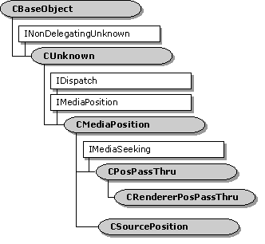

# CPosPassThru class

\[The feature associated with this page, [DirectShow](/windows/win32/directshow/directshow), is a legacy feature. It has been superseded by [MediaPlayer](/uwp/api/Windows.Media.Playback.MediaPlayer), [IMFMediaEngine](/windows/win32/api/mfmediaengine/nn-mfmediaengine-imfmediaengine), and [Audio/Video Capture in Media Foundation](windows/win32/medfound/audio-video-capture-in-media-foundation). Those features have been optimized for Windows 10 and Windows 11. Microsoft strongly recommends that new code use **MediaPlayer**, **IMFMediaEngine** and **Audio/Video Capture in Media Foundation** instead of **DirectShow**, when possible. Microsoft suggests that existing code that uses the legacy APIs be rewritten to use the new APIs if possible.\]



The `CPosPassThru` class handles seek commands for transform filters, by passing them upstream to the next filter.

When an application seeks the filter graph, the Filter Graph Manager gives the seek command to the renderer filters. The command is passed upstream, through each filter's output pin, until it reaches a filter that can execute the command (if any). For details, see [Seeking](seeking.md). The `CPosPassThru` class passes all seek commands to the output pin on the upstream filter, as shown in the following diagram.


Although this class is provided in the base class library, DirectShow also provides the same class in Quartz.dll. Using the Quartz.dll version can reduce the code size in your filter somewhat, because the class is loaded at run-time from the DLL. To use that version, call the [**CreatePosPassThru**](createpospassthru.md) function.

In your output pin's **NonDelegatingQueryInterface** method, delegate to the **CPosPassThru** object whenever the requested interface is [**IMediaSeeking**](/windows/desktop/api/Strmif/nn-strmif-imediaseeking) or [**IMediaPosition**](/windows/desktop/api/Control/nn-control-imediaposition), as shown in the following code:


```
// The following member variables are assumed:
IPin *m_pInput;    // Pointer to the input pin on your filter.
IUnknown *m_pPos;  // Pointer to the CPosPassThru object.

STDMETHODIMP CMyPin::NonDelegatingQueryInterface(REFIID riid, void **ppv)
{
    HRESULT hr
    if (riid == IID_IMediaPosition || riid == IID_IMediaSeeking) 
    {
        if (m_pPos == NULL) 
        {
            // We have not created the CPosPassThru object yet. Do so now.
            hr = CreatePosPassThru(GetOwner(), FALSE, m_pInput, &m_pPos);
            if (FAILED(hr)) return hr;
        }
        return m_pPos->QueryInterface(riid, ppv);
    } 
    else
    {
         // Other interfaces (not shown).
    }
}

~CMyPin::CMyPin() 
{
    // Release the CPosPassThruObject.
    if (m_pPos != NULL) m_pPos->Release();
}
```


Except where noted, all [**IMediaPosition**](/windows/desktop/api/Control/nn-control-imediaposition) and [**IMediaSeeking**](/windows/desktop/api/Strmif/nn-strmif-imediaseeking) methods in this class call the corresponding method on the connected pin and return the result.


| Public Methods                                                    | Description                                                                                         |
|-------------------------------------------------------------------|-----------------------------------------------------------------------------------------------------|
| [**CPosPassThru**](cpospassthru-cpospassthru.md)                 | Constructor method.                                                                                 |
| [**ForceRefresh**](cpospassthru-forcerefresh.md)                 | Obsolete.                                                                                           |
| [**GetMediaTime**](cpospassthru-getmediatime.md)                 | Retrieves the time stamps on the current sample. Virtual.                                           |
| IMediaPosition Methods                                            | Description                                                                                         |
| [**get\_Duration**](cpospassthru-get-duration.md)                | Retrieves the duration of the stream.                                                               |
| [**put\_CurrentPosition**](cpospassthru-put-currentposition.md)  | Sets the current position, relative to the total duration of the stream.                            |
| [**get\_StopTime**](cpospassthru-get-stoptime.md)                | Retrieves the time at which the playback will stop, relative to the duration of the stream.         |
| [**put\_StopTime**](cpospassthru-put-stoptime.md)                | Sets the time at which the playback will stop, relative to the duration of the stream.              |
| [**get\_PrerollTime**](cpospassthru-get-prerolltime.md)          | Retrieves the amount of data that will be queued before the start position.                         |
| [**put\_PrerollTime**](cpospassthru-put-prerolltime.md)          | Sets the amount of data that will be queued before the start position.                              |
| [**get\_Rate**](cpospassthru-get-rate.md)                        | Retrieves the playback rate.                                                                        |
| [**put\_Rate**](cpospassthru-put-rate.md)                        | Sets the playback rate.                                                                             |
| [**get\_CurrentPosition**](cpospassthru-get-currentposition.md)  | Retrieves the current position, relative to the total duration of the stream.                       |
| [**CanSeekForward**](cpospassthru-canseekforward.md)             | Determines whether the stream can be seeked backward.                                               |
| [**CanSeekBackward**](cpospassthru-canseekbackward.md)           | Determines whether the stream can be seeked forward.                                                |
| IMediaSeeking Methods                                             | Description                                                                                         |
| [**CheckCapabilities**](cpospassthru-checkcapabilities.md)       | Queries whether a stream has specified seeking capabilities.                                        |
| [**ConvertTimeFormat**](cpospassthru-converttimeformat.md)       | Converts from one time format to another.                                                           |
| [**GetAvailable**](cpospassthru-getavailable.md)                 | Retrieves the range of times in which seeking is efficient.                                         |
| [**GetCapabilities**](cpospassthru-getcapabilities.md)           | Retrieves all the seeking capabilities of the stream.                                               |
| [**GetCurrentPosition**](cpospassthru-getcurrentposition.md)     | Retrieves the current position, relative to the total duration of the stream.                       |
| [**GetDuration**](cpospassthru-getduration.md)                   | Retrieves the duration of the stream.                                                               |
| [**GetPositions**](cpospassthru-getpositions.md)                 | Retrieves the current position and the stop position, relative to the total duration of the stream. |
| [**GetPreroll**](cpospassthru-getpreroll.md)                     | Retrieves the amount of data that will be queued before the start position.                         |
| [**GetRate**](cpospassthru-getrate.md)                           | Retrieves the playback rate.                                                                        |
| [**GetStopPosition**](cpospassthru-getstopposition.md)           | Retrieves the time at which the playback will stop, relative to the duration of the stream.         |
| [**GetTimeFormat**](cpospassthru-gettimeformat.md)               | Retrieves the current time format.                                                                  |
| [**IsFormatSupported**](cpospassthru-isformatsupported.md)       | Determines whether a specified time format is supported.                                            |
| [**IsUsingTimeFormat**](cpospassthru-isusingtimeformat.md)       | Determines whether a specified time format is the format currently in use.                          |
| [**QueryPreferredFormat**](cpospassthru-querypreferredformat.md) | Retrieves the preferred time format for the stream.                                                 |
| [**SetPositions**](cpospassthru-setpositions.md)                 | Sets the current position and the stop position.                                                    |
| [**SetRate**](cpospassthru-setrate.md)                           | Sets the playback rate.                                                                             |
| [**SetTimeFormat**](cpospassthru-settimeformat.md)               | Sets the time format.                                                                               |
| Helper Functions                                                  | Description                                                                                         |
| [**CreatePosPassThru**](createpospassthru.md)                    | Creates a `CPosPassThru` or [**CRendererPosPassThru**](crendererpospassthru.md) object.            |


 

## Requirements


| Requirement | Value |
|--------------------|--------------------------------------------------------------------------------------------------------------------------------------------------------------------------------------------|
| Header<br/>  | <dl> <dt>Ctlutil.h (include Streams.h)</dt> </dl>                                                                                   |
| Library<br/> | <dl> <dt>Strmbase.lib (retail builds); </dt> <dt>Strmbasd.lib (debug builds)</dt> </dl> |


 

 


