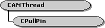

# CPullPin class

\[The feature associated with this page, [DirectShow](/windows/win32/directshow/directshow), is a legacy feature. It has been superseded by [MediaPlayer](/uwp/api/Windows.Media.Playback.MediaPlayer), [IMFMediaEngine](/windows/win32/api/mfmediaengine/nn-mfmediaengine-imfmediaengine), and [Audio/Video Capture in Media Foundation](/windows/win32/medfound/audio-video-capture-in-media-foundation). Those features have been optimized for Windows 10 and Windows 11. Microsoft strongly recommends that new code use **MediaPlayer**, **IMFMediaEngine** and **Audio/Video Capture in Media Foundation** instead of **DirectShow**, when possible. Microsoft suggests that existing code that uses the legacy APIs be rewritten to use the new APIs if possible.\]

The `CPullPin` class provides support for input pins that pull data through the [**IAsyncReader**](/windows/desktop/api/Strmif/nn-strmif-iasyncreader) interface. Use this class if you are implementing a filter that uses the pull model to request data from the upstream filter. For more information, see Data Flow in the Filter Graph and Pull Model.

This class does not derive from **CBasePin** or implement the [**IPin**](/windows/desktop/api/Strmif/nn-strmif-ipin) interface, and some of the method names clash with **IPin**, so it is best used as a helper object inside your pin. To use this class, do the following:

1.  Derive a helper class from `CPullPin`, and derive an input pin class from **CBasePin**. Declare an instance of the `CPullPin` object as a member variable of the pin class.
2.  Override the [**CBasePin::CheckConnect**](cbasepin-checkconnect.md) method to call [**CPullPin::Connect**](cpullpin-connect.md). This method queries the other pin for **IAsyncReader**.
3.  Override the [**CBasePin::BreakConnect**](cbasepin-breakconnect.md) method to call [**CPullPin::Disconnect**](cpullpin-disconnect.md).
4.  Override the [**CBasePin::Active**](cbasepin-active.md) method to call [**CPullPin::Active**](cpullpin-active.md). This method starts up a worker thread that pulls samples from the upstream filter. When the pins connect, you can specify whether you want the worker thread to make asynchronous or synchronous read requests.
5.  Override the [**CBasePin::Inactive**](cbasepin-inactive.md) method to call [**CPullPin::Inactive**](cpullpin-inactive.md). This method shuts down the worker thread.
6.  Implement the pure virtual [**CPullPin::Receive**](cpullpin-receive.md) method to process incoming samples and deliver them downstream.
7.  To set the stop and start positions, or to seek the stream, call the [**CPullPin::Seek**](cpullpin-seek.md) method. This method pauses the worker thread and flushes the filter graph.
8.  Implement the pure virtual [**CPullPin::EndOfStream**](cpullpin-endofstream.md), [**CPullPin::BeginFlush**](cpullpin-beginflush.md), and [**CPullPin::EndFlush**](cpullpin-endflush.md) methods, as described in the remarks for those methods.
9.  Implement the pure virtual [**CPullPin::OnError**](cpullpin-onerror.md) method to handle streaming errors.

| Public Member Variables                             | Description                                                                           |
|-----------------------------------------------------|---------------------------------------------------------------------------------------|
| [**m\_pAlloc**](cpullpin-m-palloc.md)              | Pointer to the **IMemAllocator** interface of the memory allocator.                   |
| Public Methods                                      | Description                                                                           |
| [**Active**](cpullpin-active.md)                   | Creates a worker thread that pulls data from the output pin.                          |
| [**AlignDown**](cpullpin-aligndown.md)             | Truncates a value to a specified alignment boundary.                                  |
| [**AlignUp**](cpullpin-alignup.md)                 | Rounds a value up to a specified alignment boundary.                                  |
| [**Connect**](cpullpin-connect.md)                 | Completes a connection to the output pin.                                             |
| [**CPullPin**](cpullpin-cpullpin.md)               | Constructor method.                                                                   |
| [**~CPullPin**](cpullpin--cpullpin.md)             | Destructor method. Virtual.                                                           |
| [**DecideAllocator**](cpullpin-decideallocator.md) | Negotiates an allocator with the output pin. Virtual.                                 |
| [**Disconnect**](cpullpin-disconnect.md)           | Beaks the connection with the output pin.                                             |
| [**Duration**](cpullpin-duration.md)               | Retrieves the duration of the stream.                                                 |
| [**GetReader**](cpullpin-getreader.md)             | Returns a pointer to the output pin's [**IAsyncReader**](/windows/desktop/api/Strmif/nn-strmif-iasyncreader) interface. |
| [**Inactive**](cpullpin-inactive.md)               | Shuts down the worker thread that pulls data from the output pin.                     |
| [**Seek**](cpullpin-seek.md)                       | Sets the start and stop positions of the stream.                                      |
| Pure Virtual Methods                                | Description                                                                           |
| [**BeginFlush**](cpullpin-beginflush.md)           | Informs the owning filter to flush the downstream filters.                            |
| [**EndFlush**](cpullpin-endflush.md)               | Informs the owning filter to end a flush operation.                                   |
| [**EndOfStream**](cpullpin-endofstream.md)         | Called after the object delivers the last sample.                                     |
| [**OnError**](cpullpin-onerror.md)                 | Called if an error occurs during streaming.                                           |
| [**Receive**](cpullpin-receive.md)                 | Called when the object receives a media sample from the output pin.                   |

 

## Requirements

| Requirement | Value |
|--------------------|--------------------------------------------------------------------------------------------------------------------------------------------------------------------------------------------|
| Header   | <dl> <dt>Pullpin.h (include Streams.h)</dt> </dl>                                                                                   |
| Library  | <dl> <dt>Strmbase.lib (retail builds); </dt> <dt>Strmbasd.lib (debug builds)</dt> </dl> |

 

 

