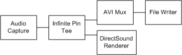

# Creating an Audio Capture Graph with Preview

The filter graph described in [Creating an Audio Capture Graph](creating-an-audio-capture-graph.md) performs capture only, with no preview. To preview and capture at the same time, the filter graph needs to use the [Infinite Pin Tee Filter](infinite-pin-tee-filter.md). This filter has one input pin and creates as many output pins as needed. (It starts with one output pin. Each time you connect an output pin, it creates another one.) The Infinite Pin Tee filter delivers every sample that it receives, unchanged, through all of its output pins.

Connect the Audio Capture Filter to the Infinite Pin Tee, and connect the Infinite Pin Tee to the multiplexer and the [DirectSound Renderer Filter](directsound-renderer-filter.md). Connect the multiplexer to the file writer, as before. The following diagram illustrates the resulting filter graph for an AVI file.

Because the DirectSound Renderer is the default audio renderer, you can simply call the [**IGraphBuilder::Render**](/windows/desktop/api/Strmif/nf-strmif-igraphbuilder-render) method on the Infinite Pin Tee's output pin. The Filter Graph Manager uses [Intelligent Connect](intelligent-connect.md) to create the renderer, add it to the filter graph, and connect the pins.

> [!Note]  
> If you capture audio from a microphone and preview it from a speaker on the same computer, you might create audio feedback.

 

## Related topics

<dl> <dt>

[Audio Capture](audio-capture.md)
</dt> </dl>

 

 

