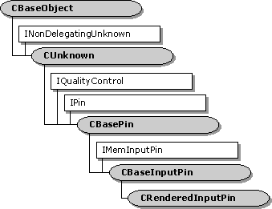

# CRenderedInputPin class

The **CRenderedInputPin** class is a base class for implementing an input pin on a renderer. This class is designed for renderer filters that do not derive from the [**CBaseRenderer**](cbaserenderer.md) class. (Filters that derive from **CBaseRenderer** should use the [**CRendererInputPin**](crendererinputpin.md) class for the input pin.)

To use this class, you must do at least the following:

-   Declare a new pin class that inherits **CRenderedInputPin**.
-   In your pin class, declare a critical section object to hold the streaming lock. You can use the [**CCritSec**](ccritsec.md) class for this purpose. For more information, see [Threads and Critical Sections](threads-and-critical-sections.md).
-   Override [**CRenderedInputPin::EndOfStream**](crenderedinputpin-endofstream.md) to hold the streaming lock.
-   Implement the [**IMemInputPin::Receive**](/windows/desktop/api/Strmif/nf-strmif-imeminputpin-receive), [**CBasePin::CheckMediaType**](cbasepin-checkmediatype.md), and [**CBasePin::GetMediaType**](cbasepin-getmediatype.md) methods.
-   In your filter, implement [**CBaseFilter::GetPin**](cbasefilter-getpin.md) to return an instance of your pin class.

You can use this class in a renderer that has more than one input pin. This class inherits the [**CBaseInputPin**](cbaseinputpin.md) class.

| Protected Member Variables                                            | Description                                                                                                  |
|-----------------------------------------------------------------------|--------------------------------------------------------------------------------------------------------------|
| [**m\_bAtEndOfStream**](crenderedinputpin-m-batendofstream.md)       | Indicates whether the end of the stream was reached.                                                         |
| [**m\_bCompleteNotified**](crenderedinputpin-m-bcompletenotified.md) | Indicates whether the pin has sent an [**EC\_COMPLETE**](ec-complete.md) event to the Filter Graph Manager. |
| Public Methods                                                        | Description                                                                                                  |
| [**Active**](crenderedinputpin-active.md)                            | Notifies the pin that the filter is now active.                                                              |
| [**CRenderedInputPin**](crenderedinputpin-crenderedinputpin.md)      | Constructor method.                                                                                          |
| [**Run**](crenderedinputpin-run.md)                                  | Notifies the pin that the filter is now running.                                                             |
| IPin Methods                                                          | Description                                                                                                  |
| [**EndFlush**](crenderedinputpin-endflush.md)                        | Ends a flush operation.                                                                                      |
| [**EndOfStream**](crenderedinputpin-endofstream.md)                  | Notifies the pin that no additional data is expected until the filter receives a new run command.            |

 

## Requirements

| Requirement | Value |
|--------------------|--------------------------------------------------------------------------------------------------------------------------------------------------------------------------------------------|
| Header   | <dl> <dt>Amextra.h (include Streams.h)</dt> </dl>                                                                                   |
| Library  | <dl> <dt>Strmbase.lib (retail builds); </dt> <dt>Strmbasd.lib (debug builds)</dt> </dl> |

 

 

