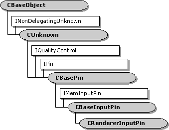

# CRendererInputPin class

\[The feature associated with this page, [DirectShow](/windows/win32/directshow/directshow), is a legacy feature. It has been superseded by [MediaPlayer](/uwp/api/Windows.Media.Playback.MediaPlayer) and [IMFMediaEngine](/windows/win32/api/mfmediaengine/nn-mfmediaengine-imfmediaengine). **MediaPlayer** and **IMFMediaEngine** have been optimized for Windows 10 and Windows 11. Microsoft strongly recommends that new code use **MediaPlayer** and **IMFMediaEngine** instead of **DirectShow**, when possible. Microsoft suggests that existing code that uses the legacy APIs be rewritten to use the new APIs if possible.\]

The **CBaseRendererInputPin** class implements an input pin for the [**CBaseRenderer**](cbaserenderer.md) class. Except where noted, the methods in this class delegate to corresponding methods on the **CBaseRenderer** class.

| Protected Member Variables                                       | Description                                                                            |
|------------------------------------------------------------------|----------------------------------------------------------------------------------------|
| [**m\_pRenderer**](crendererinputpin-m-prenderer.md)            | Pointer to the filter.                                                                 |
| Public Methods                                                   | Description                                                                            |
| [**CRendererInputPin**](crendererinputpin-crendererinputpin.md) | Constructor method.                                                                    |
| [**BreakConnect**](crendererinputpin-breakconnect.md)           | Adds customized code upon breaking a connection.                                       |
| [**CompleteConnect**](crendererinputpin-completeconnect.md)     | Completes the connection.                                                              |
| [**CheckMediaType**](crendererinputpin-checkmediatype.md)       | Determines if the pin can support a specific media type.                               |
| [**Active**](crendererinputpin-active.md)                       | Switches the pin to the active (paused or running) mode.                               |
| [**Inactive**](crendererinputpin-inactive.md)                   | Switches the pin to an inactive state and releases the memory of the allocator.        |
| [**SetMediaType**](crendererinputpin-setmediatype.md)           | Sets the media type of the pin.                                                        |
| [**Allocator**](crendererinputpin-allocator.md)                 | Retrieves a pointer to the default memory allocator.                                   |
| IPin Methods                                                     | Description                                                                            |
| [**QueryId**](crendererinputpin-queryid.md)                     | Retrieves an identifier for the pin.                                                   |
| [**EndOfStream**](crendererinputpin-endofstream.md)             | Informs the pin that no additional data is expected until a new run command is issued. |
| [**BeginFlush**](crendererinputpin-beginflush.md)               | Informs the pin to begin a flush operation.                                            |
| [**EndFlush**](crendererinputpin-endflush.md)                   | Informs the pin to end a flush operation.                                              |
| IMemInputPin Methods                                             | Description                                                                            |
| [**Receive**](crendererinputpin-receive.md)                     | Retrieves the next block of data from the stream.                                      |

 

## Requirements

| Requirement | Value |
|--------------------|--------------------------------------------------------------------------------------------------------------------------------------------------------------------------------------------|
| Header   | <dl> <dt>Renbase.h (include Streams.h)</dt> </dl>                                                                                   |
| Library  | <dl> <dt>Strmbase.lib (retail builds); </dt> <dt>Strmbasd.lib (debug builds)</dt> </dl> |

 

 

