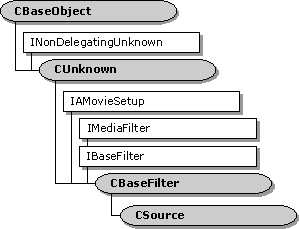

# CSource class



The **CSource** class is a base class for implementing source filters. A filter derived from **CSource** contains one or more output pins derived from the [**CSourceStream**](csourcestream.md) class. Each output pin creates a worker thread that pushes media samples downstream.

> [!Note]  
> The **CSource** class is designed to support the push model for data flow. This class is not recommended for creating file-reader filters. File readers should support the pull model, through the [**IAsyncReader**](/windows/desktop/api/Strmif/nn-strmif-iasyncreader) interface. For more information, see [Data Flow for Filter Developers](data-flow-for-filter-developers.md).

 


| Protected Member Variables                     | Description                                                  |
|------------------------------------------------|--------------------------------------------------------------|
| [**m\_iPins**](csource-m-ipins.md)            | Number of pins on the filter.                                |
| [**m\_paStreams**](csource-m-pastreams.md)    | Array of pins.                                               |
| [**m\_cStateLock**](csource-m-cstatelock.md)  | Critical section object that protects the filter state.      |
| Public Methods                                 | Description                                                  |
| [**CSource**](csource-csource.md)             | Constructor method.                                          |
| [**~CSource**](csource--csource.md)           | Destructor method.                                           |
| [**GetPinCount**](csource-getpincount.md)     | Retrieves the number of pins on the filter.                  |
| [**GetPin**](csource-getpin.md)               | Retrieves a pin.                                             |
| [**pStateLock**](csource--pstatelock.md)      | Retrieves a pointer to the filter's critical section object. |
| [**AddPin**](csource-addpin.md)               | Adds a new output pin to the filter.                         |
| [**RemovePin**](csource-removepin.md)         | Removes a specified pin from the filter.                     |
| [**FindPinNumber**](csource-findpinnumber.md) | Retrieves the number of a specified pin on the filter.       |
| IBaseFilter Methods                            | Description                                                  |
| [**FindPin**](csource-findpin.md)             | Retrieves the pin with the specified identifier.             |


 

## Remarks

To implement an output pin, do the following:

-   Derive a class from [**CSourceStream**](csourcestream.md).
-   Override the [**CSourceStream::GetMediaType**](csourcestream-getmediatype.md) method and possibly the [**CSourceStream::CheckMediaType**](csourcestream-checkmediatype.md) method, which validate media types for the pin.
-   Implement the [**CBaseOutputPin::DecideBufferSize**](cbaseoutputpin-decidebuffersize.md) method, which returns the pin's buffer requirements.
-   Implement the [**CSourceStream::FillBuffer**](csourcestream-fillbuffer.md) method, which fills a media sample buffer with data.

To implement the filter, do the following:

-   Derive a class from **CSource**.
-   In the constructor, create one or more output pins derived from [**CSourceStream**](csourcestream.md). The pins automatically add themselves to the filter in their constructor methods, and remove themselves in their destructor methods.

To synchronize the filter state among multiple threads, call the [**CSource::pStateLock**](csource--pstatelock.md) method. This method returns a pointer to the filter-state critical section. Use the [**CAutoLock**](cautolock.md) class to hold the critical section. From a pin, you can access **pStateLock** from the pin's [**CBasePin::m\_pFilter**](cbasepin-m-pfilter.md) member variable, as follows:


```
CAutoLock lock(m_pFilter->pStateLock());
```


## Requirements


| Requirement | Value |
|--------------------|--------------------------------------------------------------------------------------------------------------------------------------------------------------------------------------------|
| Header<br/>  | <dl> <dt>Source.h (include Streams.h)</dt> </dl>                                                                                    |
| Library<br/> | <dl> <dt>Strmbase.lib (retail builds); </dt> <dt>Strmbasd.lib (debug builds)</dt> </dl> |


## See also

<dl> <dt>

[Writing Source Filters](writing-source-filters.md)
</dt> </dl>

 

 


