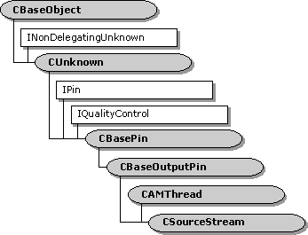

# CSourceStream class

\[The feature associated with this page, [DirectShow](/windows/win32/directshow/directshow), is a legacy feature. It has been superseded by [MediaPlayer](/uwp/api/Windows.Media.Playback.MediaPlayer), [IMFMediaEngine](/windows/win32/api/mfmediaengine/nn-mfmediaengine-imfmediaengine), and [Audio/Video Capture in Media Foundation](/windows/win32/medfound/audio-video-capture-in-media-foundation). Those features have been optimized for Windows 10 and Windows 11. Microsoft strongly recommends that new code use **MediaPlayer**, **IMFMediaEngine** and **Audio/Video Capture in Media Foundation** instead of **DirectShow**, when possible. Microsoft suggests that existing code that uses the legacy APIs be rewritten to use the new APIs if possible.\]

The **CSourceStream** class provides an output pin for the [**CSource**](csource.md) filter class.

For information on using this class, see [**CSource**](csource.md). This class inherits the [**CAMThread**](camthread.md) class, which provides a worker thread for streaming data from the pin. The **CSourceStream** class implements the following helper methods to send requests to the thread:

-   [**CSourceStream::Exit**](csourcestream-exit.md)
-   [**CSourceStream::Init**](csourcestream-init.md)
-   [**CSourceStream::Pause**](csourcestream-pause.md)
-   [**CSourceStream::Run**](csourcestream-run.md)
-   [**CSourceStream::Stop**](csourcestream-stop.md)

The first request to the thread must be [**Init**](csourcestream-init.md). The [**Exit**](csourcestream-exit.md) request terminates the thread. In practice, it is not necessary to call any of these methods directly, because the pin's [**CSourceStream::Active**](csourcestream-active.md) and [**CSourceStream::Inactive**](csourcestream-inactive.md) methods call them as needed.

The class also provides several "handler" methods:

-   [**CSourceStream::OnThreadCreate**](csourcestream-onthreadcreate.md)
-   [**CSourceStream::OnThreadDestroy**](csourcestream-onthreaddestroy.md)
-   [**CSourceStream::OnThreadStartPlay**](csourcestream-onthreadstartplay.md)

These do nothing in the base class, but the derived class can override them.

| Protected Member Variables                                             | Description                                                                                                                       |
|------------------------------------------------------------------------|-----------------------------------------------------------------------------------------------------------------------------------|
| [**m\_pFilter**](csourcestream-m-pfilter.md)                          | Pointer to the filter that contains this pin.                                                                                     |
| Protected Methods                                                      | Description                                                                                                                       |
| [**OnThreadCreate**](csourcestream-onthreadcreate.md)                 | Called when the streaming thread is initialized. Virtual.                                                                         |
| [**OnThreadDestroy**](csourcestream-onthreaddestroy.md)               | Called when the streaming thread is about to exit. Virtual.                                                                       |
| [**OnThreadStartPlay**](csourcestream-onthreadstartplay.md)           | Called at the start of the [**CSourceStream::DoBufferProcessingLoop**](csourcestream-dobufferprocessingloop.md) method. Virtual. |
| [**Active**](csourcestream-active.md)                                 | Notifies the pin that the filter is now active.                                                                                   |
| [**Inactive**](csourcestream-inactive.md)                             | Notifies the pin that the filter is no longer active.                                                                             |
| [**GetRequest**](csourcestream-getrequest.md)                         | Waits for the next thread request.                                                                                                |
| [**CheckRequest**](csourcestream-checkrequest.md)                     | Checks if there is a thread request, without blocking.                                                                            |
| [**ThreadProc**](csourcestream-threadproc.md)                         | Thread procedure. Virtual.                                                                                                        |
| [**DoBufferProcessingLoop**](csourcestream-dobufferprocessingloop.md) | Generates media data and delivers it to the downstream input pin. Virtual.                                                        |
| [**CheckMediaType**](csourcestream-checkmediatype.md)                 | Determines if the pin accepts a specific media type. Virtual.                                                                     |
| [**GetMediaType**](csourcestream-getmediatype.md)                     | Retrieves a preferred media type. Virtual.                                                                                        |
| Public Methods                                                         | Description                                                                                                                       |
| [**CSourceStream**](csourcestream-csourcestream.md)                   | Constructor method.                                                                                                               |
| [**~ CSourceStream**](csourcestream--csourcestream.md)                | Destructor method. Virtual.                                                                                                       |
| [**Init**](csourcestream-init.md)                                     | Initializes the streaming thread.                                                                                                 |
| [**Exit**](csourcestream-exit.md)                                     | Signals the streaming thread to exit.                                                                                             |
| [**Run**](csourcestream-run.md)                                       | Signals the streaming thread to run.                                                                                              |
| [**Pause**](csourcestream-pause.md)                                   | Signals the streaming thread to become active.                                                                                    |
| [**Stop**](csourcestream-stop.md)                                     | Signals the streaming thread to stop.                                                                                             |
| Pure Virtual Methods                                                   | Description                                                                                                                       |
| [**FillBuffer**](csourcestream-fillbuffer.md)                         | Fills a media sample with data.                                                                                                   |
| IPin Methods                                                           | Description                                                                                                                       |
| [**QueryId**](/windows/desktop/api/Strmif/nf-strmif-ipin-queryid)                                        | Retrieves an identifier for the pin.                                                                                              |

 

## Requirements

| Requirement | Value |
|--------------------|--------------------------------------------------------------------------------------------------------------------------------------------------------------------------------------------|
| Header   | <dl> <dt>Source.h (include Streams.h)</dt> </dl>                                                                                    |
| Library  | <dl> <dt>Strmbase.lib (retail builds); </dt> <dt>Strmbasd.lib (debug builds)</dt> </dl> |

## See also

<dl> <dt>

[Writing Source Filters](writing-source-filters.md)
</dt> </dl>

 

 

