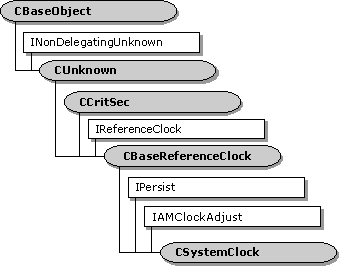

# CSystemClock class

\[The feature associated with this page, [DirectShow](/windows/win32/directshow/directshow), is a legacy feature. It has been superseded by [MediaPlayer](/uwp/api/Windows.Media.Playback.MediaPlayer), [IMFMediaEngine](/windows/win32/api/mfmediaengine/nn-mfmediaengine-imfmediaengine), and [Audio/Video Capture in Media Foundation](windows/win32/medfound/audio-video-capture-in-media-foundation). Those features have been optimized for Windows 10 and Windows 11. Microsoft strongly recommends that new code use **MediaPlayer**, **IMFMediaEngine** and **Audio/Video Capture in Media Foundation** instead of **DirectShow**, when possible. Microsoft suggests that existing code that uses the legacy APIs be rewritten to use the new APIs if possible.\]

The `CSystemClock` class implements a clock that returns the system time.

This class derives from the [**CBaseReferenceClock**](cbasereferenceclock.md) class, and adds support for the **IPersist** and [**IAMClockAdjust**](/windows/desktop/api/Strmif/nn-strmif-iamclockadjust) interfaces.

| Public Methods                                        | Description                                         |
|-------------------------------------------------------|-----------------------------------------------------|
| [**CreateInstance**](csystemclock-createinstance.md) | Creates a new instance of this object.              |
| [**CSystemClock**](csystemclock-csystemclock.md)     | Constructor method.                                 |
| IAMClockAdjust Methods                                | Description                                         |
| [**SetClockDelta**](csystemclock-setclockdelta.md)   | Adjusts the clock time.                             |
| IPersist Methods                                      | Description                                         |
| [**GetClassID**](csystemclock-getclassid.md)         | Returns the class identifier (CLSID) of the object. |

 

 

 

