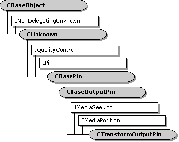

# CTransformOutputPin class

\[The feature associated with this page, [DirectShow](/windows/win32/directshow/directshow), is a legacy feature. It has been superseded by [MediaPlayer](/uwp/api/Windows.Media.Playback.MediaPlayer), [IMFMediaEngine](/windows/win32/api/mfmediaengine/nn-mfmediaengine-imfmediaengine), and [Audio/Video Capture in Media Foundation](windows/win32/medfound/audio-video-capture-in-media-foundation). Those features have been optimized for Windows 10 and Windows 11. Microsoft strongly recommends that new code use **MediaPlayer**, **IMFMediaEngine** and **Audio/Video Capture in Media Foundation** instead of **DirectShow**, when possible. Microsoft suggests that existing code that uses the legacy APIs be rewritten to use the new APIs if possible.\]

The `CTransformOutputPin` class implements an output pin that is used by the [**CTransformFilter**](ctransformfilter.md) class.

Typically, you do not need to derive from this class. Most of the methods in this class call corresponding methods on the **CTransformFilter** class, which you can override. If you derive from this class, you must override the filter's [**CTransformFilter::GetPin**](ctransformfilter-getpin.md) method to create instances of your derived class.

This class exposes the **IMediaSeeking** and **IMediaPosition** interfaces through the [**CPosPassThru**](cpospassthru.md) object. It passes all seek requests to the next filter upstream.

| Protected Member Variables                                               | Description                                              |
|--------------------------------------------------------------------------|----------------------------------------------------------|
| [**m\_pTransformFilter**](ctransformoutputpin-m-ptransformfilter.md)    | Pointer to the owning filter.                            |
| Public Member Variables                                                  | Description                                              |
| [**m\_pPosition**](ctransformoutputpin-m-pposition.md)                  | Helper object to pass seek commands upstream.            |
| Public Methods                                                           | Description                                              |
| [**CTransformOutputPin**](ctransformoutputpin-ctransformoutputpin.md)   | Constructor method.                                      |
| [**~CTransformOutputPin**](ctransformoutputpin--ctransformoutputpin.md) | Destructor method.                                       |
| [**CheckConnect**](ctransformoutputpin-checkconnect.md)                 | Determines whether a pin connection is suitable.         |
| [**BreakConnect**](ctransformoutputpin-breakconnect.md)                 | Releases the pin from a connection.                      |
| [**CompleteConnect**](ctransformoutputpin-completeconnect.md)           | Completes a connection to another pin.                   |
| [**CheckMediaType**](ctransformoutputpin-checkmediatype.md)             | Determines if the pin accepts a specific media type.     |
| [**SetMediaType**](ctransformoutputpin-setmediatype.md)                 | Sets the media type for the connection.                  |
| [**DecideBufferSize**](ctransformoutputpin-decidebuffersize.md)         | Sets the buffer requirements.                            |
| [**GetMediaType**](ctransformoutputpin-getmediatype.md)                 | Retrieves a preferred media type, by index value.        |
| [**CurrentMediaType**](ctransformoutputpin-currentmediatype.md)         | Retrieves the media type for the current pin connection. |
| IPin Methods                                                             | Description                                              |
| [**QueryId**](ctransformoutputpin-queryid.md)                           | Retrieves an identifier for the pin.                     |
| IQualityControl Methods                                                  | Description                                              |
| [**Notify**](ctransformoutputpin-notify.md)                             | Notifies the pin that a quality change is requested.     |

 

## Requirements

| Requirement | Value |
|--------------------|--------------------------------------------------------------------------------------------------------------------------------------------------------------------------------------------|
| Header   | <dl> <dt>Transfrm.h (include Streams.h)</dt> </dl>                                                                                  |
| Library  | <dl> <dt>Strmbase.lib (retail builds); </dt> <dt>Strmbasd.lib (debug builds)</dt> </dl> |

 

 

