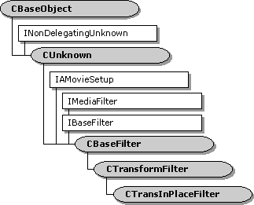

# CTransInPlaceFilter class

\[The feature associated with this page, [DirectShow](/windows/win32/directshow/directshow), is a legacy feature. It has been superseded by [MediaPlayer](/uwp/api/Windows.Media.Playback.MediaPlayer), [IMFMediaEngine](/windows/win32/api/mfmediaengine/nn-mfmediaengine-imfmediaengine), and [Audio/Video Capture in Media Foundation](windows/win32/medfound/audio-video-capture-in-media-foundation). Those features have been optimized for Windows 10 and Windows 11. Microsoft strongly recommends that new code use **MediaPlayer**, **IMFMediaEngine** and **Audio/Video Capture in Media Foundation** instead of **DirectShow**, when possible. Microsoft suggests that existing code that uses the legacy APIs be rewritten to use the new APIs if possible.\]

The `CTransInPlaceFilter` class is designed for in-place transform filters, which are filters that modify the input data rather than copying the data across buffers.To use this class, derive a new class from `CTransInPlaceFilter` and implement the following methods:

-   [**CTransformFilter::CheckInputType**](ctransformfilter-checkinputtype.md)
-   [**CTransInPlaceFilter::Transform**](ctransinplacefilter-transform.md)

This class uses the [**CTransInPlaceInputPin**](ctransinplaceinputpin.md) class for its input pin, and the [**CTransInPlaceOutputPin**](ctransinplaceoutputpin.md) class for its output pin. Typically, you do not need to override these pin classes. The filter creates both pins in the [**CTransInPlaceFilter::GetPin**](ctransinplacefilter-getpin.md) method. If you do override the pin classes, you must override **GetPin** to create your custom pins.

This class is designed so the input type always matches the output type. Whenever possible, the filter uses a single allocator for both pin connections.

## Preferred Media Types

If the output pin is already connected, the input pin offers the downstream filter's preferred types. (In fact it simply returns the downstream filter's enumerator object.) Otherwise, it has no preferred types. The output pin has the same behavior, but in reverse: If the input pin is already connected, the output pin offers the upstream filter's preferred types. Otherwise, it has no preferred types

## Pin Connections

When one pin connects, the filter generally reconnects the other pin, to make sure that both pins use the same media type and the same allocator. (The mechanism for reconnecting pins is described in [Reconnecting Pins](reconnecting-pins.md).) Two scenarios are possible: Either the input pin connects first, or the output pin connects first.

Suppose the input pin connects first. The following steps occur:

1.  The input pin calls the filter's [**CheckInputType**](ctransformfilter-checkinputtype.md) method to check the media type.
2.  The upstream filter selects an allocator. At this point, the input pin has no allocator requirements, and it accepts any allocator for the connection. If the upstream filter requests an allocator, the pin creates a new one. For reasons described shortly, this allocator will not be used in the final connection. It is provided only to help finish this stage of the connection process.

Later, when the output pin connects:

1.  The output pin calls the filter's [**CheckInputType**](ctransformfilter-checkinputtype.md) method to check the media type. It also calls [**IPin::QueryAccept**](/windows/desktop/api/Strmif/nf-strmif-ipin-queryaccept) on the upstream filter. This ensures that the input pin can change its media type to match.
2.  The output pin calls the filter's [**CheckInputType**](ctransformfilter-checkinputtype.md) method to check the media type. It also calls [**IPin::QueryAccept**](/windows/desktop/api/Strmif/nf-strmif-ipin-queryaccept) on the upstream filter. This ensures that the input pin can change its media type to match.
3.  The output pin calls the filter's [**CheckInputType**](ctransformfilter-checkinputtype.md) method to check the media type. It also calls [**IPin::QueryAccept**](/windows/desktop/api/Strmif/nf-strmif-ipin-queryaccept) on the upstream filter. This ensures that the input pin can change its media type to match.
4.  This time, the input pin's [**GetAllocator**](ctransinplaceinputpin-getallocator.md) method returns the downstream allocator, and [**GetAllocatorRequirements**](ctransinplaceinputpin--getallocatorrequirements.md) returns the downstream filter's allocator requirements. The input pin accepts whatever allocator the upstream filter chooses.
5.  This time, the input pin's [**GetAllocator**](ctransinplaceinputpin-getallocator.md) method returns the downstream allocator, and [**GetAllocatorRequirements**](ctransinplaceinputpin--getallocatorrequirements.md) returns the downstream filter's allocator requirements. The input pin accepts whatever allocator the upstream filter chooses.

Now consider the opposite scenario, where the output pin is the first pin to connect.

1.  The output pin calls the filter's [**CheckInputType**](ctransformfilter-checkinputtype.md) method to check the media type.
2.  It selects an allocator, preferring to use the downstream filter's allocator.

Then, when the input pin connects:

1.  The input pin checks the media type by calling [**CheckInputType**](ctransformfilter-checkinputtype.md) on the filter, and by calling [**QueryAccept**](/windows/desktop/api/Strmif/nf-strmif-ipin-queryaccept) on the downstream filter's output pin.
2.  If the input type does not match the output type, the filter reconnects the output pin.
3.  The upstream filter selects an allocator. The input pin's [**GetAllocator**](ctransinplaceinputpin-getallocator.md) method returns the downstream allocator, and the input pin accepts whatever allocator the upstream filter selects.
4.  The filter uses the same allocator for the downstream connection, possibly overriding the original downstream allocator.

This sequence of events changes slightly if any of the allocators involved are read-only, because the downstream allocator must be writable. In that case, the filter might use two separate allocators.

For more information about using this class, see [Writing Transform Filters](writing-transform-filters.md).

| Protected Member Variables                                                        | Description                                                                      |
|-----------------------------------------------------------------------------------|----------------------------------------------------------------------------------|
| [**m\_bModifiesData**](ctransinplacefilter-m-bmodifiesdata.md)                   | Indicates whether the filter modifies the sample data.                           |
| Protected Methods                                                                 | Description                                                                      |
| [**Copy**](ctransinplacefilter-copy.md)                                          | Copies a media sample.                                                           |
| [**InputPin**](ctransinplacefilter-inputpin.md)                                  | Retrieves a pointer to the filter's input pin.                                   |
| [**OutputPin**](ctransinplacefilter-outputpin.md)                                | Retrieves a pointer to the filter's output pin.                                  |
| [**TypesMatch**](ctransinplacefilter-typesmatch.md)                              | Determines whether the input media type matches the output media type.           |
| [**UsingDifferentAllocators**](ctransinplacefilter--usingdifferentallocators.md) | Determines whether the input and output pins are using different allocators.     |
| Public Methods                                                                    | Description                                                                      |
| [**CTransInPlaceFilter**](ctransinplacefilter-ctransinplacefilter.md)            | Constructor method.                                                              |
| [**GetPin**](ctransinplacefilter-getpin.md)                                      | Retrieves a pin.                                                                 |
| [**GetMediaType**](ctransinplacefilter-getmediatype.md)                          | Retrieves a preferred media type for the output pin.                             |
| [**DecideBufferSize**](ctransinplacefilter-decidebuffersize.md)                  | Sets the output pin's buffer requirements.                                       |
| [**CheckTransform**](ctransinplacefilter-checktransform.md)                      | Checks whether an input media type is compatible with an output media type.      |
| [**CompleteConnect**](ctransinplacefilter-completeconnect.md)                    | Completes a pin connection.                                                      |
| [**Receive**](ctransinplacefilter-receive.md)                                    | Receives a media sample, processes it, and delivers it to the downstream filter. |
| Pure Virtual Methods                                                              | Description                                                                      |
| [**Transform**](ctransinplacefilter-transform.md)                                | Transforms a sample in place.                                                    |

 

## Requirements

| Requirement | Value |
|--------------------|--------------------------------------------------------------------------------------------------------------------------------------------------------------------------------------------|
| Header   | <dl> <dt>Transip.h (include Streams.h)</dt> </dl>                                                                                   |
| Library  | <dl> <dt>Strmbase.lib (retail builds); </dt> <dt>Strmbasd.lib (debug builds)</dt> </dl> |

 

 

