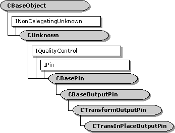

# CTransInPlaceOutputPin class

\[The feature associated with this page, [DirectShow](/windows/win32/directshow/directshow), is a legacy feature. It has been superseded by [MediaPlayer](/uwp/api/Windows.Media.Playback.MediaPlayer), [IMFMediaEngine](/windows/win32/api/mfmediaengine/nn-mfmediaengine-imfmediaengine), and [Audio/Video Capture in Media Foundation](/windows/win32/medfound/audio-video-capture-in-media-foundation). Those features have been optimized for Windows 10 and Windows 11. Microsoft strongly recommends that new code use **MediaPlayer**, **IMFMediaEngine** and **Audio/Video Capture in Media Foundation** instead of **DirectShow**, when possible. Microsoft suggests that existing code that uses the legacy APIs be rewritten to use the new APIs if possible.\]

The `CTransInPlaceOutputPin` class implements an output pin that is used by the [**CTransInPlaceFilter**](ctransinplacefilter.md) class.

Typically, you do not need to derive from this class. If you do, you must override the filter's [**CTransInPlaceFilter::GetPin**](ctransinplacefilter-getpin.md) method to create instances of your derived class.

| Protected Member Variables                                                      | Description                                          |
|---------------------------------------------------------------------------------|------------------------------------------------------|
| [**m\_pTIPFilter**](ctransinplaceoutputpin-m-ptipfilter.md)                    | Pointer to the filter that created this pin.         |
| Public Methods                                                                  | Description                                          |
| [**CTransInPlaceOutputPin**](ctransinplaceoutputpin-ctransinplaceoutputpin.md) | Constructor method.                                  |
| [**CheckMediaType**](ctransinplaceoutputpin-checkmediatype.md)                 | Determines if the pin accepts a specific media type. |
| [**SetAllocator**](ctransinplaceoutputpin-setallocator.md)                     | Specifies an allocator for the connection.           |
| [**ConnectedIMemInputPin**](ctransinplaceoutputpin-connectedimeminputpin.md)   | Retrieves a pointer to the downstream input pin.     |
| [**PeekAllocator**](ctransinplaceoutputpin-peekallocator.md)                   | Retrieves a pointer to the pin's allocator.          |
| IPin Methods                                                                    | Description                                          |
| [**EnumMediaTypes**](ctransinplaceoutputpin-enummediatypes.md)                 | Enumerates the pin's preferred media types.          |

 

## Requirements

| Requirement | Value |
|--------------------|--------------------------------------------------------------------------------------------------------------------------------------------------------------------------------------------|
| Header   | <dl> <dt>Transip.h (include Streams.h)</dt> </dl>                                                                                   |
| Library  | <dl> <dt>Strmbase.lib (retail builds); </dt> <dt>Strmbasd.lib (debug builds)</dt> </dl> |

 

 

