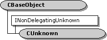

# CUnknown class

The **CUnknown** class implements the **IUnknown** interface. Most Component Object Model (COM) objects in DirectShow derive from **CUnknown**.

If you implement a COM object, you might want to derive it from **CUnknown**. Deriving from **CUnknown** provides a thread-safe implementation, and saves you the trouble of implementing **IUnknown**.

For a detailed discussion of how to use this base class, see [How to Implement IUnknown](how-to-implement-iunknown.md). What follows is a brief summary:

-   Include the [**DECLARE\_IUNKNOWN**](declare-iunknown.md) macro in the public section of your class definition. This macro declares the three methods of the **IUnknown** interface.
-   Override the [**NonDelegatingQueryInterface**](cunknown-nondelegatingqueryinterface.md) method to support interfaces other than **IUnknown**. Within this method, call the [**GetInterface**](getinterface.md) function to retrieve interface pointers.
-   In your class constructor, invoke the **CUnknown** constructor method.

| Protected Member Variables                                                  | Description                                                        |
|-----------------------------------------------------------------------------|--------------------------------------------------------------------|
| [**m\_cRef**](cunknown-m-cref.md)                                          | Reference count.                                                   |
| Public Methods                                                              | Description                                                        |
| [**CUnknown**](cunknown-cunknown.md)                                       | Constructor method.                                                |
| [**~ CUnknown**](cunknown--cunknown.md)                                    | Destructor method. Virtual.                                        |
| [**GetOwner**](cunknown-getowner.md)                                       | Gets a pointer to the controlling **IUnknown**.                    |
| INonDelegatingUnknown Methods                                               | Description                                                        |
| [**NonDelegatingAddRef**](cunknown-nondelegatingaddref.md)                 | Increments the reference count.                                    |
| [**NonDelegatingQueryInterface**](cunknown-nondelegatingqueryinterface.md) | Retrieves an interface pointer and increments the reference count. |
| [**NonDelegatingRelease**](cunknown-nondelegatingrelease.md)               | Decrements the reference count.                                    |

 

## Requirements

| Requirement | Value |
|--------------------|--------------------------------------------------------------------------------------------------------------------------------------------------------------------------------------------|
| Header   | <dl> <dt>Combase.h (include Streams.h)</dt> </dl>                                                                                   |
| Library  | <dl> <dt>Strmbase.lib (retail builds); </dt> <dt>Strmbasd.lib (debug builds)</dt> </dl> |

## See also

<dl> <dt>

[DirectShow Base Classes](directshow-base-classes.md)
</dt> </dl>

 

 

