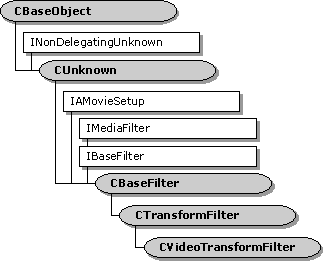

# CVideoTransformFilter class

\[The feature associated with this page, [DirectShow](/windows/win32/directshow/directshow), is a legacy feature. It has been superseded by [MediaPlayer](/uwp/api/Windows.Media.Playback.MediaPlayer), [IMFMediaEngine](/windows/win32/api/mfmediaengine/nn-mfmediaengine-imfmediaengine), and [Audio/Video Capture in Media Foundation](windows/win32/medfound/audio-video-capture-in-media-foundation). Those features have been optimized for Windows 10 and Windows 11. Microsoft strongly recommends that new code use **MediaPlayer**, **IMFMediaEngine** and **Audio/Video Capture in Media Foundation** instead of **DirectShow**, when possible. Microsoft suggests that existing code that uses the legacy APIs be rewritten to use the new APIs if possible.\]

The `CVideoTransformFilter` class is designed primarily as a base class for AVI decompressor filters. This class adds support for quality control to the [**CTransformFilter**](ctransformfilter.md) class. The filter's **Receive** method can decide to drop frames, based on quality messages from the renderer and performance measurements that the filter collects while it is streaming.

If the filter drops a frame, it continues to drop frames until it reaches the next key frame. For MPEG streams, the filter does not distinguish between B frames and P frames.

| Protected Member Variables                                                      | Description                                                                                    |
|---------------------------------------------------------------------------------|------------------------------------------------------------------------------------------------|
| [**m\_bQualityChanged**](cvideotransformfilter-m-bqualitychanged.md)           | Indicates whether the filter has dropped frames.                                               |
| [**m\_bSkipping**](cvideotransformfilter-m-bskipping.md)                       | Indicates whether the filter is currently dropping frames.                                     |
| [**m\_itrAvgDecode**](cvideotransformfilter-m-itravgdecode.md)                 | Average length of time it has taken to decode a frame.                                         |
| [**m\_itrLate**](cvideotransformfilter-m-itrlate.md)                           | Indicates how late the samples are arriving at the renderer.                                   |
| [**m\_nFramesSinceKeyFrame**](cvideotransformfilter-m-nframessincekeyframe.md) | The number of frames that the filter has received since the last key frame.                    |
| [**m\_nKeyFramePeriod**](cvideotransformfilter-m-nkeyframeperiod.md)           | The largest observed interval between key frames.                                              |
| [**m\_nWaitForKey**](cvideotransformfilter-m-nwaitforkey.md)                   | The current maximum number of delta frames to drop.                                            |
| [**m\_tDecodeStart**](cvideotransformfilter-m-tdecodestart.md)                 | Length of time that it took to decode the most recent sample.                                  |
| Protected Methods                                                               | Description                                                                                    |
| [**AbortPlayback**](cvideotransformfilter-abortplayback.md)                    | Used to signal a streaming error.                                                              |
| [**AlterQuality**](cvideotransformfilter-alterquality.md)                      | Notifies the filter that a quality change is requested.                                        |
| [**Receive**](cvideotransformfilter-receive.md)                                | Receives a media sample, processes it, and delivers an output sample to the downstream filter. |
| [**ShouldSkipFrame**](cvideotransformfilter-shouldskipframe.md)                | Determines whether the filter should drop a specified sample.                                  |
| [**StartStreaming**](cvideotransformfilter-startstreaming.md)                  | Called when the filter switches to the paused state.                                           |
| Public Methods                                                                  | Description                                                                                    |
| [**CVideoTransformFilter**](cvideotransformfilter-cvideotransformfilter.md)    | Constructor method.                                                                            |
| [**EndFlush**](cvideotransformfilter-endflush.md)                              | Ends a flush operation.                                                                        |

 

 

 

