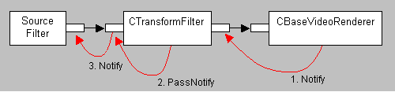

# Default Quality Control

\[The feature associated with this page, [DirectShow](/windows/win32/directshow/directshow), is a legacy feature. It has been superseded by [MediaPlayer](/uwp/api/Windows.Media.Playback.MediaPlayer) and [IMFMediaEngine](/windows/win32/api/mfmediaengine/nn-mfmediaengine-imfmediaengine). **MediaPlayer** and **IMFMediaEngine** have been optimized for Windows 10 and Windows 11. Microsoft strongly recommends that new code use **MediaPlayer** and **IMFMediaEngine** instead of **DirectShow**, when possible. Microsoft suggests that existing code that uses the legacy APIs be rewritten to use the new APIs if possible.\]

The [DirectShow Base Classes](directshow-base-classes.md) implement some default behaviors for video quality control.

Quality messages start at the renderer. The base class for video renderers is [**CBaseVideoRenderer**](cbasevideorenderer.md), which has the following behavior:

1.  When the video renderer receives a sample, it compares the time stamp on the sample with the current reference time.
2.  The video renderer generates a quality message. In the base class, the **Proportion** member of the quality message is limited to a range of 500 (50%) to 2000 (200%). Values outside this range could result in abrupt quality changes.
3.  By default, the video renderer sends the quality message to the upstream output pin (the pin connected to its input pin). Applications can override this behavior by calling the **SetSink** method.

What happens next depends on the upstream filter. Typically, this is a transform filter. The base class for transform filters is [**CTransformFilter**](ctransformfilter.md), which uses the [**CTransformInputPin**](ctransforminputpin.md) and [**CTransformOutputPin**](ctransformoutputpin.md) classes to implement input and output pins. Together, these classes have the following behavior:

1.  The [**CTransformOutputPin::Notify**](ctransformoutputpin-notify.md) method calls [**CTransformFilter::AlterQuality**](ctransformfilter-alterquality.md), a private method on the filter base class.
2.  Derived filters can override **AlterQuality** to handle the quality message. By default, **AlterQuality** ignores the quality message.
3.  If **AlterQuality** does not handle the quality message, the output pin calls [**CBaseInputPin::PassNotify**](cbaseinputpin-passnotify.md), a private method on the filter's input pin.
4.  **PassNotify** passes the quality message to the appropriate place—the next upstream output pin, or a custom quality manager.

Assuming that no transform filter handles the quality message, the message eventually reaches the output pin on the source filter. In the base classes, [**CBasePin::Notify**](cbasepin-notify.md) returns E\_NOTIMPL. How a particular source filter handles quality messages depends on the nature of the source. Some sources, such as live video capture, cannot perform meaningful quality control. Other sources can adjust the rate at which they deliver samples.

The following diagram illustrates the default behavior.

The base video renderer implements **IQualityControl::Notify**, which means you can pass quality messages to the renderer itself. If you set the **Proportion** member to a value less than 1000, the video renderer inserts a wait period between each frame that it renders, in effect slowing down the renderer. (You might do this to reduce system usage, for example.) For more information, see [**CBaseVideoRenderer::ThrottleWait**](cbasevideorenderer-throttlewait.md). Setting the **Proportion** member to a value greater than 1000 has no effect.

## Related topics

<dl> <dt>

[Quality-Control Management](quality-control-management.md)
</dt> </dl>

 

 

