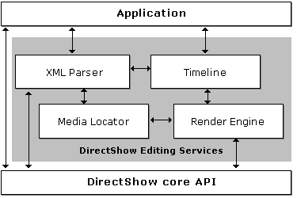

# DirectShow Editing Services Architecture

\[The feature associated with this page, [DirectShow](/windows/win32/directshow/directshow), is a legacy feature. It has been superseded by [MediaPlayer](/uwp/api/Windows.Media.Playback.MediaPlayer), [IMFMediaEngine](/windows/win32/api/mfmediaengine/nn-mfmediaengine-imfmediaengine), and [Audio/Video Capture in Media Foundation](windows/win32/medfound/audio-video-capture-in-media-foundation). Those features have been optimized for Windows 10 and Windows 11. Microsoft strongly recommends that new code use **MediaPlayer**, **IMFMediaEngine** and **Audio/Video Capture in Media Foundation** instead of **DirectShow**, when possible. Microsoft suggests that existing code that uses the legacy APIs be rewritten to use the new APIs if possible.\]

\[This API is not supported and may be altered or unavailable in the future.\]

The following illustration shows the architecture of [DirectShow Editing Services](directshow-editing-services.md) (DES).

-   Timeline: Represents a video production as a collection of source clips, transitions, and effects, organized into a set of nested tracks. For more information, see [The Timeline Model](the-timeline-model.md).
-   XML Parser: Parses the timeline and generates an output file, or reads an input file and generates a timeline. DES supports an XML-based persistence format.
-   Render engine: Translates the timeline into a form that can be rendered as streaming media. By default, the render engine produces a DirectShow filter graph (see next section).
-   Media locator: Maintains a cache of locations of media elements. When an attempt to open a media element fails, DES uses the cache to locate the element, based on a history of successful opens.

The timeline is an abstract description of a video editing project. It specifies the source clips used in the project, start and stop times, effects and transitions, and so forth. The timeline does not render the video and audio streams, however. Instead, the render engine translates the timeline into a filter graph, for either preview or file output. An application manipulates the timeline rather than directly manipulating the filter graph, which would be cumbersome and error prone.

The following table lists the main tasks that a typical video editing application performs, along with the interfaces that support each task. Later sections describe these tasks and the interfaces in more detail.

| Task                                     | Interface(s)                                                                             |
|------------------------------------------|------------------------------------------------------------------------------------------|
| Construct or modify a timeline.          | [**IAMTimeline**](iamtimeline.md) and the other **IAMTimelineXXXX** interfaces          |
| Save and load project files.             | [**IXml2Dex**](ixml2dex.md)                                                             |
| Preview a project or write it to a file. | [**IRenderEngine**](irenderengine.md), [**ISmartRenderEngine**](ismartrenderengine.md) |

 

In addition, an application might perform some or all of the following secondary tasks.

| Task                                                                                           | Interface(s)                                                                 |
|------------------------------------------------------------------------------------------------|------------------------------------------------------------------------------|
| Obtain information about media files. (Number of streams; format and duration of each stream.) | [**IMediaDet**](imediadet.md)                                               |
| Set properties on transitions and effects.                                                     | [**IPropertySetter**](ipropertysetter.md)                                   |
| Receive notification when errors occur during rendering.                                       | [**IAMSetErrorLog**](iamseterrorlog.md), [**IAMErrorLog**](iamerrorlog.md) |
| Retrieve poster frames.                                                                        | [**IMediaDet**](imediadet.md), [**ISampleGrabber**](isamplegrabber.md)     |

 

## Related topics

<dl> <dt>

[Getting Started with DirectShow Editing Services](getting-started-with-directshow-editing-services.md)
</dt> </dl>

 

 

