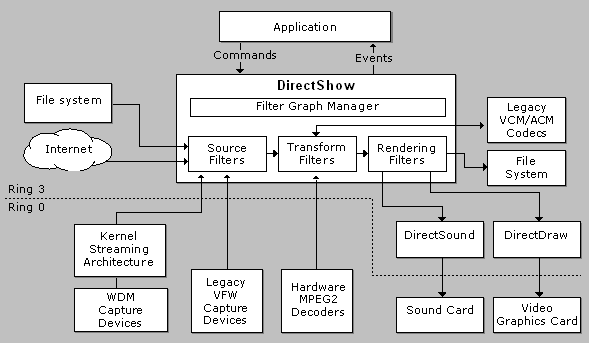

# DirectShow System Overview

\[The feature associated with this page, [DirectShow](/windows/win32/directshow/directshow), is a legacy feature. It has been superseded by [MediaPlayer](/uwp/api/Windows.Media.Playback.MediaPlayer) and [IMFMediaEngine](/windows/win32/api/mfmediaengine/nn-mfmediaengine-imfmediaengine). **MediaPlayer** and **IMFMediaEngine** have been optimized for Windows 10 and Windows 11. Microsoft strongly recommends that new code use **MediaPlayer** and **IMFMediaEngine** instead of **DirectShow**, when possible. Microsoft suggests that existing code that uses the legacy APIs be rewritten to use the new APIs if possible.\]

**The Challenge of Multimedia**

Working with multimedia presents several major challenges:

-   Multimedia streams contain large amounts of data, which must be processed very quickly.
-   Audio and video must be synchronized so that it starts and stops at the same time, and plays at the same rate.
-   Data can come from many sources, including local files, computer networks, television broadcasts, and video cameras.
-   Data comes in a variety of formats, such as Audio-Video Interleaved (AVI), Advanced Streaming Format (ASF), Motion Picture Experts Group (MPEG), and Digital Video (DV).
-   The programmer does not know in advance what hardware devices will be present on the end-user's system.

**The DirectShow Solution**

DirectShow is designed to address each of these challenges. Its main design goal is to simplify the task of creating digital media applications on the Windows platform, by isolating applications from the complexities of data transports, hardware differences, and synchronization.

To achieve the throughput needed to stream video and audio, DirectShow uses Direct3D and DirectSound whenever possible. These technologies render data efficiently to the user's sound and graphics cards. DirectShow synchronizes playback by encapsulating media data in time-stamped samples. To handle the variety of sources, formats, and hardware devices that are possible, DirectShow uses a modular architecture, in which the application mixes and matches different software components called *filters*.

DirectShow provides filters that support capture and tuning devices based on the Windows Driver Model (WDM), as well as filters that support older Video for Windows (VfW) capture cards, and codecs written for the Audio Compression Manager (ACM) and Video Compression Manager (VCM) interfaces.

The following diagram shows the relationship between an application, the DirectShow components, and some of the hardware and software components that DirectShow supports.

As illustrated here, DirectShow filters communicate with, and control, a wide variety of devices, including the local file system, TV tuner and video capture cards, VfW codecs, the video display (through DirectDraw or GDI), and the sound card (through DirectSound). Thus, DirectShow insulates the application from many of the complexities of these devices. DirectShow also provides native compression and decompression filters for certain file formats.

## Related topics

<dl> <dt>

[About DirectShow](about-directshow.md)
</dt> </dl>

 

 

