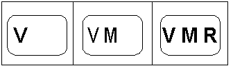

# Display an app-supplied bitmap on the composited image

\[The feature associated with this page, [DirectShow](/windows/win32/directshow/directshow), is a legacy feature. It has been superseded by [MediaPlayer](/uwp/api/Windows.Media.Playback.MediaPlayer), [IMFMediaEngine](/windows/win32/api/mfmediaengine/nn-mfmediaengine-imfmediaengine), and [Audio/Video Capture in Media Foundation](windows/win32/medfound/audio-video-capture-in-media-foundation). Those features have been optimized for Windows 10 and Windows 11. Microsoft strongly recommends that new code use **MediaPlayer**, **IMFMediaEngine** and **Audio/Video Capture in Media Foundation** instead of **DirectShow**, when possible. Microsoft suggests that existing code that uses the legacy APIs be rewritten to use the new APIs if possible.\]

Applications can use the VMR's mixing mode to display alpha-blended channel logos, a user interface, or advertisements either partially or completely within the video rectangle. Because the blending is performed in hardware by the graphics processor, there is minimal impact to the playback performance of the Video Stream, and there are no detectable flicker or tearing artifacts. Applications can change the image displayed as frequently as they wish. It should be noted that changes are only reflected on the screen when the DirectShow filter graph is in the running state.

The VMR uses its mixer component to overlay the bitmap onto the composited image. With the VMR-7, the application must force the VMR to load its mixer, even if there is only a single video stream. This is not necessary with the VMR-9 since it loads its mixer by default.

To blend a static bitmap image with the video stream, the application creates the VMR and adds it to the graph, and then calls [**IVMRFilterConfig::SetNumberOfStreams**](/windows/desktop/api/Strmif/nf-strmif-ivmrfilterconfig-setnumberofstreams). The value passed to this function identifies the number of input pins that the VMR should create. Applications can specify any value between 1 and MAX\_MIXER\_STREAMS; specifying a value of 1 is valid if the application only intends to display a single video stream. Even though the VMR-7 has a single input pin by default, this method must be called in order to force it to load its mixer component. (The VMR-9 loads its mixer and sets up four pins by default.)

To set the bitmap, use the [**IVMRMixerBitmap**](/windows/desktop/api/Strmif/nn-strmif-ivmrmixerbitmap) interface on the VMR-7 or the [**IVMRMixerBitmap9**](/previous-versions/windows/desktop/api/Vmr9/nn-vmr9-ivmrmixerbitmap9) interface on the VMR-9.

The bitmap can be specified by either a handle to a GDI Device Context (hDC) or by a DirectDraw Surface interface. If the application wants the image to contain embedded alpha information (also known as per pixel alpha) it must place the image data in a DirectDraw Surface interface. This is because it is not currently possible to place per-pixel alpha information with a GDI Device Context. The DirectDraw surface must be either RGB32 or ARGB32, and should preferably be a system memory surface. It is not necessary for the surface dimensions to be a power of 2.

The VMR allows applications to specify the location and an overall transparency value for the image. The following code shows how to pass image data down to the VMR for subsequent blending:


```C++
HRESULT BlendApplicationImage( 
  HWND hwndApp,
  IVMRWindowlessControl* pWc,
  HBITMAP hbm
)
{
    LONG cx, cy;
    HRESULT hr;
    hr = pWc->GetNativeVideoSize(&cx, &cy, NULL, NULL);
    if (FAILED(hr))
        return hr;
    
    HDC hdc = GetDC(hwndApp);
    if (hdc == NULL)
    {
        return E_FAIL;
    }
    
    HDC hdcBmp = CreateCompatibleDC(hdc);
    ReleaseDC(hwndApp, hdc);
    
    if (hdcBmp == NULL)
    {
        return E_FAIL;
    }
    
    BITMAP bm;
    if (0 == GetObject(hbm, sizeof(bm), &bm))
    {
        DeleteDC(hdcBmp);
        return E_FAIL;
    }
    
    HBITMAP hbmOld = (HBITMAP)SelectObject(hdcBmp, hbm);
    if (hbmOld == 0)
    {
        DeleteDC(hdcBmp);
        return E_FAIL;
    }
    
    VMRALPHABITMAP bmpInfo;
    ZeroMemory(&bmpInfo, sizeof(bmpInfo) );
    bmpInfo.dwFlags = VMRBITMAP_HDC;
    bmpInfo.hdc = hdcBmp;
    
    // Show the entire bitmap in the top-left corner of the video image.
    SetRect(&bmpInfo.rSrc, 0, 0, bm.bmWidth, bm.bmHeight);
    bmpInfo.rDest.left = 0.f;
    bmpInfo.rDest.top = 0.f;
    bmpInfo.rDest.right = (float)bm.bmWidth / (float)cx;
    bmpInfo.rDest.bottom = (float)bm.bmHeight / (float)cy;
    
    // Set the transparency value (1.0 is opaque, 0.0 is transparent).
    bmpInfo.fAlpha = 0.2f;
    
    IVMRMixerBitmap* pBmp;
    hr = pWc->QueryInterface(IID_IVMRMixerBitmap, (LPVOID *)&pBmp);
    if (SUCCEEDED(hr)) 
    {
        pBmp->SetAlphaBitmap(&bmpInfo);
        pBmp->Release();
    }
    
    DeleteObject(SelectObject(hdcBmp, hbmOld));
    DeleteDC(hdcBmp);
    return hr;
}
```


The concepts discussed in this topic are demonstrated in the [VMRPlayer Sample](vmrplayer-sample.md) sample application.

**Creating Simple Animations with the Bitmap Image**

To create a simple animated bitmap logo, put all of the bitmap "frames" into a single image, as shown in the following illustration.



When you set the bitmap initially using [**IVMRMixerBitmap::SetAlphaBitmap**](/windows/desktop/api/Strmif/nf-strmif-ivmrmixerbitmap-setalphabitmap), if the bitmap is in an HDC, set the **rSrc** field of the **VMRALPHABITMAP** structure to specify the size of the entire bitmap within the HDC. The **top** and **left** members of the structure are set to 0, and the **right** and **bottom** members are the width and height of the bitmap. If the bitmap is in a DirectDraw surface, then the size of the surface is known, so there is no need to specify rSrc in this method.

When you call [**IVMRMixerBitmap::UpdateAlphaBitmapParameters**](/windows/desktop/api/Strmif/nf-strmif-ivmrmixerbitmap-updatealphabitmapparameters), use the **rSrc** member for both HDC and DirectDraw bitmaps, to specify the particular frame or rectangle within the image that you wish to display, and set the **VMRBITMAP\_SRCRECT** flag in the **dwFlags** member.

## Related topics

<dl> <dt>

[Using VMR Mixing Mode](using-vmr-mixing-mode.md)
</dt> </dl>

 

 


