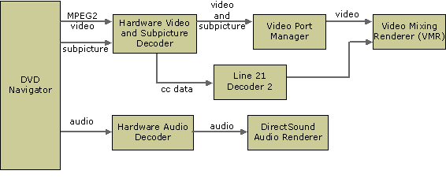

# DVD Filter Graph Configuration

\[The feature associated with this page, [DirectShow](/windows/win32/directshow/directshow), is a legacy feature. It has been superseded by [MediaPlayer](/uwp/api/Windows.Media.Playback.MediaPlayer) and [IMFMediaEngine](/windows/win32/api/mfmediaengine/nn-mfmediaengine-imfmediaengine). **MediaPlayer** and **IMFMediaEngine** have been optimized for Windows 10 and Windows 11. Microsoft strongly recommends that new code use **MediaPlayer** and **IMFMediaEngine** instead of **DirectShow**, when possible. Microsoft suggests that existing code that uses the legacy APIs be rewritten to use the new APIs if possible.\]

This section describes the various filter graph configurations for DVD playback in DirectShow. These diagrams are provided mainly for reference. The DVD Navigator builds the graph, so in general it is not necessary to understand the details of how the graph is configured. For more information, see [Building the DVD Filter Graph](building-the-dvd-filter-graph.md).

The following illustration shows a DVD filter graph with a software decoder.

When a hardware decoder is present, it is typically connected directly to the video card by a video port. This enables the decoded video bits to be sent directly to the frame buffer on the graphics card without passing into host memory. To manage this direct connection on earlier versions of Windows, DirectShow supports DirectDraw Video Port Extensions (VPE) through an interface on the [Overlay Mixer Filter](overlay-mixer-filter.md).

> [!Note]  
> The Overlay Mixer is now deprecated.

 

In Windows XP and later, a hardware decoder can connect to the [Video Port Manager](video-port-manager.md) filter.

In all these graphs, the DVD Navigator is the source filter; it performs several tasks:

-   Reads the navigation and video data from the disc.
-   Demultiplexes the video, audio, and subpicture data into separate streams.
-   Pumps the streams into the graph for further processing and eventual rendering.
-   Informs your application of DVD-related events.

On the audio stream, the DVD Navigator connects downstream to an audio decoder, which connects to the [DirectSound Renderer Filter](directsound-renderer-filter.md), the default audio renderer. On the video and subpicture streams, the downstream filters are the third-party video decoder, and the Video Mixing Renderer (or the [Overlay Mixer](overlay-mixer-filter.md), and the [Video Renderer](video-renderer-filter.md) on downlevel applications). If your application will handle line 21 closed-captioned data, you must add the DirectShow Line 21 Decoder 2 filter to the graph. This involves a single method call; the filter will be connected automatically.

Your application communicates with and controls the DVD Navigator through the custom interfaces that the DVD Navigator exposes: [**IDvdControl2**](/windows/desktop/api/Strmif/nn-strmif-idvdcontrol2)—the "set" methods—and [**IDvdInfo2**](/windows/desktop/api/Strmif/nn-strmif-idvdinfo2)—the "get" methods. It also must communicate with the filter graph manager (through [**IMediaControl**](/windows/desktop/api/Control/nn-control-imediacontrol)) to stop, start, and otherwise control the graph. You might also need to control other individual filters, such as the Overlay Mixer filter for switching between windowed and full-screen display. For more information, see [**IMixerPinConfig2**](/windows/desktop/api/Mpconfig/nn-mpconfig-imixerpinconfig2). The exact configuration of the graph will vary depending on what type of MPEG-2 decoder you have installed, whether you need to handle line 21 closed-captioned data, and other factors.

## Related topics

<dl> <dt>

[DVD Applications](dvd-applications.md)
</dt> </dl>

 

 

