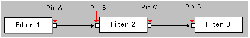

# Dynamic Reconnection

\[The feature associated with this page, [DirectShow](/windows/win32/directshow/directshow), is a legacy feature. It has been superseded by [MediaPlayer](/uwp/api/Windows.Media.Playback.MediaPlayer) and [IMFMediaEngine](/windows/win32/api/mfmediaengine/nn-mfmediaengine-imfmediaengine). **MediaPlayer** and **IMFMediaEngine** have been optimized for Windows 10 and Windows 11. Microsoft strongly recommends that new code use **MediaPlayer** and **IMFMediaEngine** instead of **DirectShow**, when possible. Microsoft suggests that existing code that uses the legacy APIs be rewritten to use the new APIs if possible.\]

In most DirectShow filters, pins cannot be reconnected while the graph is actively streaming data. The application must stop the graph before reconnecting the pins. However, some filters do support pin reconnections while the graph is running, a process known as dynamic reconnection. This can be done either by the application, or by a filter in the graph.

As an example, consider the graph in the following illustration.



One scenario for dynamic reconnection might be to remove Filter 2 from the graph, while the graph is running, and replace it with another filter. For this scenario to work, the following must be true:

-   The input pin on Filter 3 (pin D) must support the [**IPinConnection**](/windows/desktop/api/Strmif/nn-strmif-ipinconnection) interface. This interface enables the pin to be reconnected without stopping the filter.
-   The output pin on Filter 1 (pin A) must be able to block the flow of media data while the reconnection occurs. No data can travel between pin A and pin D during the reconnection. Generally, this means the output pin must support the [**IPinFlowControl**](/windows/desktop/api/Strmif/nn-strmif-ipinflowcontrol) interface. However, if Filter 1 is the filter that initiates the reconnection, it might have some internal mechanism to block its own data flow.

The dynamic reconnection will involve the following steps:

1.  Block the data stream from pin A.
2.  Reconnect pin A to pin D, possibly through a new intermediate filter.
3.  Unblock pin A so that data starts to flow again.

**Step 1. Block the Data Stream**

To block the data stream, call [**IPinFlowControl::Block**](/windows/desktop/api/Strmif/nf-strmif-ipinflowcontrol-block) on pin A. This method can be called either asynchronously or synchronously. To call the method *asynchronously*, create a Win32 event object and pass the event handle to the **Block** method. The method will return immediately. Wait for the event to be signaled, using a function such as **WaitForSingleObject**. The pin signals the event when it has blocked the data flow. For example:


```C++
// Create an event
HANDLE hEvent = CreateEvent(NULL, FALSE, FALSE, NULL);
if (hEvent != NULL)
{
    // Block the data flow.
    hr = pFlowControl->Block(AM_PIN_FLOW_CONTROL_BLOCK, hEvent); 
    if (SUCCEEDED(hr))
    {
        // Wait for the pin to finish.
        DWORD dwRes = WaitForSingleObject(hEvent, dwMilliseconds);
    }
}
```


To call the method *synchronously*, simply pass the value **NULL** instead of the event handle. Now the method will block until the operation completes. This may not happen until the pin is ready to deliver a new sample. If the filter is paused, this can take an arbitrary length of time. Therefore, do not make the synchronous call from your main application thread. Use a worker thread, or else call the method asynchronously.

**Step 2. Reconnect the Pins**

To reconnect the pins, query the Filter Graph Manager for the **IGraphConfig** interface and call either [**IGraphConfig::Reconnect**](/windows/desktop/api/Strmif/nf-strmif-igraphconfig-reconnect) or [**IGraphConfig::Reconfigure**](/windows/desktop/api/Strmif/nf-strmif-igraphconfig-reconfigure). The **Reconnect** method is simpler to use; it does the following:

-   Stops the intermediate filters (Filter 2 in the example) and removes them from the graph.
-   Adds new intermediate filters, if needed.
-   Connects all the pins.
-   Pauses or runs any new filters, to match the state of the graph.

The **Reconnect** method has several optional parameters that can be used to specify the media type for the pin connection and the intermediate filter to use. For example:


```C++
pGraph->AddFilter(pNewFilter, L"New Filter for the Graph");
pConfig->Reconnect(
    pPinA,      // Reconnect this output pin...
    pPinD,      // ... to this input pin.
    pMediaType, // Use this media type.
    pNewFilter, // Connect them through this filter.
    NULL, 
    0);     
```


For details, consult the reference page. If the **Reconnect** method is not flexible enough, you can use the **Reconfigure** method, which calls an application-defined callback method to reconnect the pins. To use this method, implement the [**IGraphConfigCallback**](/windows/desktop/api/Strmif/nn-strmif-igraphconfigcallback) interface in your application.

Before calling **Reconfigure**, block the data flow from the output pin, as described previously. Then push any data that is still pending in the section of the graph that you are reconnecting, as follows:

1.  Call [**IPinConnection::NotifyEndOfStream**](/windows/desktop/api/Strmif/nf-strmif-ipinconnection-notifyendofstream) on the input pin furthest downstream in the reconnection chain (pin D in the example). Pass in a handle to a Win32 event.
2.  Call [**IPin::EndOfStream**](/windows/desktop/api/Strmif/nf-strmif-ipin-endofstream) on the input pin that is immediately downstream from the output pin where you blocked the data flow. (In this example, the data flow was blocked at pin A, so you would call **EndOfStream** on pin B.)
3.  Wait for the event to be signaled. The input pin (pin D) signals the event when it receives the end-of-stream notification. This indicates that no data is traveling between the pins, and that the caller can safely reconnect the pins.

Note that the **IGraphConfig::Reconnect** method automatically handles the previous steps. You only need to perform these steps if you are using the **Reconfigure** method.

After the data is pushed through the graph, call **Reconfigure** and pass a pointer to your **IGraphConfigCallback** callback interface. The Filter Graph Manager will call the [**IGraphConfigCallback::Reconfigure**](/windows/desktop/api/Strmif/nf-strmif-igraphconfigcallback-reconfigure) method that you have provided.

**Step 3. Unblock the Data Flow**

After you have reconnected the pins, unblock the data flow by calling **IPinFlowControl::Block** with a value of zero for the first parameter.

> [!Note]  
> If a dynamic reconnection is performed by a filter, there are some threading issues that you must be aware of. If the Filter Graph Manager tries to stop the filter, it can deadlock, because the graph waits for the filter to stop, while at the same time the filter may be waiting for data to be pushed through the graph. To prevent the possible deadlock, some of the methods described in this section take a handle to a Win32 event. The filter should signal the event if the Filter Graph Manager attempts to stop the filter. For more information, see [**IGraphConfig**](/windows/desktop/api/Strmif/nn-strmif-igraphconfig) and [**IPinConnection**](/windows/desktop/api/Strmif/nn-strmif-ipinconnection).

 

## Related topics

<dl> <dt>

[Dynamic Graph Building](dynamic-graph-building.md)
</dt> </dl>

 

 


