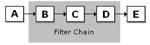

# Filter Chains

A *filter chain* is a sequence of filters that meets the following conditions:

-   Each filter in the chain has at most one connected input pin and one connected output pin.
-   It is possible to traverse every filter in the chain without traversing filters outside the chain.

For example, in the following diagram, filters A–B, C–D, and F–G–H are filter chains. Each subchain in F–G–H (F–G and G–H) is also a filter chain. A filter chain can consist of a single filter, so filters A, B, C, D, F, G, and H are also distinct filter chains. Filter E has two input connections, so any sequence of filters that includes filter E is not a filter chain.

The [**IFilterChain**](/windows/desktop/api/Strmif/nn-strmif-ifilterchain) interface provides the following methods for controlling filter chains:

| Label | Value |
|---------------------------------------------------------------|---------------------------------|
| [**IFilterChain::StartChain**](/windows/desktop/api/Strmif/nf-strmif-ifilterchain-startchain)   | Starts a chain.                 |
| [**IFilterChain::StopChain**](/windows/desktop/api/Strmif/nf-strmif-ifilterchain-stopchain)     | Stops a chain.                  |
| [**IFilterChain::PauseChain**](/windows/desktop/api/Strmif/nf-strmif-ifilterchain-pausechain)   | Pauses a chain.                 |
| [**IFilterChain::RemoveChain**](/windows/desktop/api/Strmif/nf-strmif-ifilterchain-removechain) | Removes a chain from the graph. |

 

There is no specific method for adding a chain. To add a chain, insert the new filters using the [**IFilterGraph::AddFilter**](/windows/desktop/api/Strmif/nf-strmif-ifiltergraph-addfilter) method. Then connect the filters by calling [**IGraphBuilder::Connect**](/windows/desktop/api/Strmif/nf-strmif-igraphbuilder-connect), [**IGraphBuilder::Render**](/windows/desktop/api/Strmif/nf-strmif-igraphbuilder-render), or similar methods.

When the graph is running, a filter chain can switch between running and stopped. When the graph is paused, it can switch between paused and stopped. These are the only state transitions possible with filter chains.

## Filter Chain Guidelines

When you use **IFilterChain** methods, it is important to make sure that the filters in the graph can support filter chaining operations. Otherwise, you might cause deadlocks or graph errors. Filters connected to the chain must function correctly after the chain changes state.

The best way to use **IFilterChain** is with a set of filters that you have designed specifically for chaining. Use the following guidelines to ensure that your filters are safe for filter chain operations. These points refer to the following diagram.

-   Before the filter chain's state changes, all data processing calls at the boundary of the filter chain must be completed. This rule applies to the methods [**IMemInputPin::Receive**](/windows/desktop/api/Strmif/nf-strmif-imeminputpin-receive), [**IPin::NewSegment**](/windows/desktop/api/Strmif/nf-strmif-ipin-newsegment), and [**IPin::EndOfStream**](/windows/desktop/api/Strmif/nf-strmif-ipin-endofstream). Filters in the chain must return from calls to these methods made by filters outside the chain; and filters outside the chain must return from calls made by filters within the chain.

For example, in the previous diagram, filter B must complete any data processing calls from filter A, and filter E must finish any calls from filter D. If the pins expose the [**IPinFlowControl**](/windows/desktop/api/Strmif/nn-strmif-ipinflowcontrol) and [**IPinConnection**](/windows/desktop/api/Strmif/nn-strmif-ipinconnection) interfaces, you can push the data through the graph by calling the [**IPinFlowControl::Block**](/windows/desktop/api/Strmif/nf-strmif-ipinflowcontrol-block) and [**IGraphConfig::PushThroughData**](/windows/desktop/api/Strmif/nf-strmif-igraphconfig-pushthroughdata) methods, as described in [Dynamic Reconnection](dynamic-reconnection.md). Filters might also support private methods for pushing the data.

-   Upstream filters must expect the chain's state to change. For example, in the previous diagram, suppose the chain is stopped but filter A calls **IMemInputPin::Receive**. The call fails and the response of filter A is to stop streaming. When the application restarts the chain, it has no effect because filter A is no longer streaming data.
-   Downstream filters must also expect the chain's state to change. If not, the downstream filter might block while it waits for samples that never arrive. For example, multiplexer (MUX) filters often require data from all of their input pins. Halting the flow of data from one input pin might block the other streams from processing. This can cause the graph to deadlock.
-   Each pin connection from a filter outside the chain to a filter within the chain should have its own allocator, which is not shared by other connections. When the chain changes state or is removed from the graph, the allocator might be decommitted. If other connections were using the same allocator, they can no longer process samples.
-   Do not remove a chain unless the filters connected to the chain support dynamic disconnection. Typically, the connected filters will support the **IPinConnection** or **IPinFlowControl** interface, but might support private interfaces instead.

## Related topics

<dl> <dt>

[Dynamic Graph Building](dynamic-graph-building.md)
</dt> </dl>

 

 

