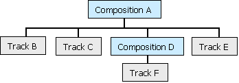

# IAMTimelineComp::GetRecursiveLayerOfType method

\[The feature associated with this page, [DirectShow](/windows/win32/directshow/directshow), is a legacy feature. It has been superseded by [MediaPlayer](/uwp/api/Windows.Media.Playback.MediaPlayer), [IMFMediaEngine](/windows/win32/api/mfmediaengine/nn-mfmediaengine-imfmediaengine), and [Audio/Video Capture in Media Foundation](/windows/win32/medfound/audio-video-capture-in-media-foundation). Those features have been optimized for Windows 10 and Windows 11. Microsoft strongly recommends that new code use **MediaPlayer**, **IMFMediaEngine** and **Audio/Video Capture in Media Foundation** instead of **DirectShow**, when possible. Microsoft suggests that existing code that uses the legacy APIs be rewritten to use the new APIs if possible.\]

> [!Note]  
> \[Deprecated. This API may be removed from future releases of Windows.\]

 

The `GetRecursiveLayerOfType` method performs a depth-first ordering of the virtual tracks contained in this composition, and retrieves the *n*th virtual track from that ordering.

## Syntax


```C++
HRESULT GetRecursiveLayerOfType(
  [out] IAMTimelineObj      **ppVirtualTrack,
        long                WhichLayer,
        TIMELINE_MAJOR_TYPE Type
);
```


## Parameters

<dl> <dt>

*ppVirtualTrack* \[out\]
</dt> <dd>

Receives a pointer to the virtual track's [**IAMTimelineObj**](iamtimelineobj.md) interface.

</dd> <dt>

*WhichLayer* 
</dt> <dd>

Specifies which virtual track to retrieve, indexed from zero.

</dd> <dt>

*Type* 
</dt> <dd>

Member of the [**TIMELINE\_MAJOR\_TYPE**](timeline-major-type.md) enumerated type that specifies whether to include tracks in the search.

</dd> </dl>

## Return value

Returns one of the following **HRESULT** values:


| Return code                                                                                  | Description                                 |
|----------------------------------------------------------------------------------------------|---------------------------------------------|
| <dl> <dt>**S\_OK**</dt> </dl>         | Success.<br/>                         |
| <dl> <dt>**E\_INVALIDARG**</dt> </dl> | No object of the specified type.<br/> |
| <dl> <dt>**E\_POINTER**</dt> </dl>    | **NULL** pointer argument.<br/>       |


 

## Remarks

Typically, an application will not need to call this method.

If the *Type* parameter is TIMELINE\_MAJOR\_TYPE\_TRACK, the depth-first ordering includes tracks. If not, it includes only compositions and groups. The object itself is included in the ordering.

For example, in the following arrangement, starting from Composition A, the ordering would be B, C, F, D, E, A.



If the method succeeds, the **IAMTimelineObj** interface that it returns has an outstanding reference count. Be sure to release the interface when you are finished using it.

> [!Note]  
> The header file Qedit.h is not compatible with Direct3D headers later than version 7.

 

> [!Note]  
> To obtain Qedit.h, download the [Microsoft Windows SDK Update for Windows Vista and .NET Framework 3.0](https://msdn.microsoft.com/windowsvista/bb980924.aspx). Qedit.h is not available in the Microsoft Windows SDK for Windows 7 and .NET Framework 3.5 Service Pack 1.

 

## Requirements


| Requirement | Value |
|--------------------|-----------------------------------------------------------------------------------------|
| Header<br/>  | <dl> <dt>Qedit.h</dt> </dl>      |
| Library<br/> | <dl> <dt>Strmiids.lib</dt> </dl> |


## See also

<dl> <dt>

[**IAMTimelineComp Interface**](iamtimelinecomp.md)
</dt> <dt>

[Error and Success Codes](error-and-success-codes.md)
</dt> </dl>

 

 


