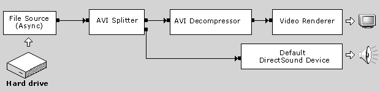
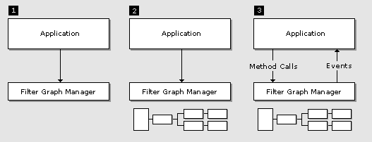

# Introduction to DirectShow Application Programming

\[The feature associated with this page, [DirectShow](/windows/win32/directshow/directshow), is a legacy feature. It has been superseded by [MediaPlayer](/uwp/api/Windows.Media.Playback.MediaPlayer), [IMFMediaEngine](/windows/win32/api/mfmediaengine/nn-mfmediaengine-imfmediaengine), and [Audio/Video Capture in Media Foundation](windows/win32/medfound/audio-video-capture-in-media-foundation). Those features have been optimized for Windows 10 and Windows 11. Microsoft strongly recommends that new code use **MediaPlayer**, **IMFMediaEngine** and **Audio/Video Capture in Media Foundation** instead of **DirectShow**, when possible. Microsoft suggests that existing code that uses the legacy APIs be rewritten to use the new APIs if possible.\]

This article introduces the basic terminology and concepts that are used in DirectShow. After reading this section, you will be ready to write your first DirectShow application.

**Filters and Filter Graphs**

The building block of DirectShow is a software component called a *filter*. A filter is a software component that performs some operation on a multimedia stream. For example, DirectShow filters can

-   read files
-   get video from a video capture device
-   decode various stream formats, such as MPEG-1 video
-   pass data to the graphics or sound card

Filters receive input and produce output. For example, if a filter decodes MPEG-1 video, the input is the MPEG-encoded stream and the output is a series of uncompressed video frames.

In DirectShow, an application performs any task by connecting chains of filters together, so that the output from one filter becomes the input for another. A set of connected filters is called a *filter graph*. For example, the following diagram shows a filter graph for playing an AVI file.

The File Source filter reads the AVI file from the hard disk. The AVI Splitter filter parses the file into two streams, a compressed video stream and an audio stream. The AVI Decompressor filter decodes the video frames. The Video Renderer filter draws the frames to the display, using DirectDraw or GDI. The Default DirectSound Device filter plays the audio stream, using DirectSound.

The application does not have to manage all of this data flow. Instead, the filters are controlled by a high-level component called the Filter Graph Manager. The application makes high-level API calls such as "Run" (to move data through the graph) or "Stop" (to stop the flow of data). If you require more control over the stream operations, you can access the filters directly through COM interfaces. The Filter Graph Manager also passes event notifications to the application.

The Filter Graph Manager serves another purpose as well: It provides methods for the application to build the filter graph, by connecting the filters together. (DirectShow also provides various helper objects that simplify this process. These are thoroughly described in the documentation.)

**Writing a DirectShow Application**

In broad terms, there are three tasks that any DirectShow application must perform. These are illustrated in the following diagram.

1.  The application creates an instance of the Filter Graph Manager.
2.  The application uses the Filter Graph Manager to build a filter graph. The exact set of filters in the graph will depend on the application.
3.  The application uses the Filter Graph Manager to control the filter graph and stream data through the filters. Throughout this process, the application will also respond to events from the Filter Graph Manager.

When processing is completed, the application releases the Filter Graph Manager and all of the filters.

DirectShow is based on COM; the Filter Graph Manager and the filters are all COM objects. You should have a general understanding of COM client programming before you begin programming DirectShow. Many books about COM programming are available.

To get started with DirectShow, read the article [How To Play a File](how-to-play-a-file.md), which presents a simple console application to play a video file. The section [About DirectShow](about-directshow.md) explains the DirectShow architecture in more detail, while the section [Using DirectShow](using-directshow.md) examines the major scenarios that are supported by DirectShow, such as capture, video editing, DVD playback, and television.

 

 

