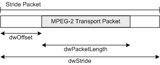

# MPEG2\_TRANSPORT\_STRIDE structure

\[The feature associated with this page, [DirectShow](/windows/win32/directshow/directshow), is a legacy feature. It has been superseded by [MediaPlayer](/uwp/api/Windows.Media.Playback.MediaPlayer), [IMFMediaEngine](/windows/win32/api/mfmediaengine/nn-mfmediaengine-imfmediaengine), and [Audio/Video Capture in Media Foundation](/windows/win32/medfound/audio-video-capture-in-media-foundation). Those features have been optimized for Windows 10 and Windows 11. Microsoft strongly recommends that new code use **MediaPlayer**, **IMFMediaEngine** and **Audio/Video Capture in Media Foundation** instead of **DirectShow**, when possible. Microsoft suggests that existing code that uses the legacy APIs be rewritten to use the new APIs if possible.\]

The `MPEG2_TRANSPORT_STRIDE` structure describes the format of MPEG-2 transport stream (TS) packets. This structure allows for transports streams in which the 188-byte transport packets are not contiguous. For the purpose of this documentation, such packets are referred to as *stride packets*.

Stride packets are identified by the following media type:


| Label | Value |
|-------------|----------------------------------------|
| Major Type  | MEDIATYPE\_Stream                      |
| Subtype     | MEDIASUBTYPE\_MPEG2\_TRANSPORT\_STRIDE |
| Format Type | FORMAT\_None                           |


 

The format block (**pbFormat**) is optional. If the format block is included, it must begin with an **MPEG2\_TRANSPORT\_STRIDE** structure. This structure defines the layout of the transport packet within the stride packet. If the format block is **NULL**, the packets are assumed to use a set of default values; see the Remarks section for details.

## Syntax


```C++
typedef struct _MPEG2_TRANSPORT_STRIDE {
  DWORD dwOffset;
  DWORD dwPacketLength;
  DWORD dwStride;
} MPEG2_TRANSPORT_STRIDE, *PMPEG2_TRANSPORT_STRIDE;
```


## Members

<dl> <dt>

**dwOffset**
</dt> <dd>

Specifies the offset, in bytes, from the beginning of the packet to the first byte of the embedded transport packet. The value must range from zero to `(dwStride - dwPacketLength)`, inclusive.

</dd> <dt>

**dwPacketLength**
</dt> <dd>

Specifies the length of the embedded transport packet, in bytes. For standard MPEG-2 transport packets, the value must be 188 bytes.

</dd> <dt>

**dwStride**
</dt> <dd>

Specifies the length of the entire stride packet, in bytes. The value must be at least `(dwOffset + dwPacketLength)`.

</dd> </dl>

## Remarks

The following diagram illustrates the relations between the structure members.



Input buffers that contain multiplexed stride packets have some restrictions:

-   Stride packets must be packed contiguously within the buffer.
-   No bytes may precede the first stride packet or follow the last stride packet.
-   An integral number of stride packets must fit in the buffer; that is, buffer length % dwStride equals zero.

There is no restriction on the number of stride packets per buffer.

If the media type does not contain a format block (**pbFormat** is **NULL**), the following default values are used:

-   **dwOffset**: 0
-   **dwPacketLength**: 188
-   **dwStride**: 188

## Requirements


| Requirement | Value |
|-------------------|---------------------------------------------------------------------------------------|
| Header<br/> | <dl> <dt>Bdatypes.h</dt> </dl> |


## See also

<dl> <dt>

[DirectShow Structures](directshow-structures.md)
</dt> <dt>

[MPEG-2 Media Types](mpeg-2-media-types.md)
</dt> </dl>

 

 


