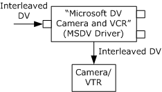

# MSDV Driver

MSDV is the Microsoft Windows Driver Model (WDM) driver for DV camcorders. The driver appears as a DirectShow filter when the device is plugged in. It is enumerated in two filter categories:

-   CLSID\_VideoInputDeviceCategory ("Video Capture Sources")
-   AM\_KSCATEGORY\_RENDER ("WDM Streaming Rendering Devices")

The filter's friendly name is `Microsoft DV Camera and VCR`, or a localized equivalent. In some devices, the **Description** property contains a description of the specific model, which can be used instead of the generic friendly name. For more information, see [Selecting a Capture Device](selecting-a-capture-device.md).

MSDV has two output pins. One pin delivers DV frames that contain interleaved audio and video data. The other pin delivers video-only frames with no audio. MSDV cannot stream from both pins at once, so only one output pin can be connected at a time. For more information about capturing video from a DV device, see [Capture DV to File](capture-dv-to-file.md).

Most DV camcorders have a video tape recorder (VTR) subunit, which can transmit data from tape to the computer. For the application, capturing from tape works the same as capturing live video. The only difference is that the application must control the external tape transport — start and stop the tape, rewind, and so forth. For this purpose, MSDV exposes the [**IAMExtDevice**](/windows/desktop/api/Strmif/nn-strmif-iamextdevice), [**IAMExtTransport**](/windows/desktop/api/Strmif/nn-strmif-iamexttransport), and [**IAMTimecodeReader**](/windows/desktop/api/Strmif/nn-strmif-iamtimecodereader) interfaces. For more information about controlling a VTR, see [Controlling a DV Camcorder](controlling-a-dv-camcorder.md).

You can also transmit DV from the computer to the camcorder. The video can then be viewed in the camcorder's onboard screen, or recorded to tape. To support this functionality, MSDV has an input pin that can receive an interleaved DV stream. When the input pin is connected, MSDV acts as a renderer filter instead of a capture filter. MSDV does not support seeking in this mode. For more information about sending DV to the device, see [Transmit DV from File to Tape](transmit-dv-from-file-to-tape.md).

Note that the input and output pins cannot be connected at the same time, because the device cannot stream in both directions at the same time.

In many camcorders, switching between VTR mode and camera mode causes the device to switch off. Therefore, DirectShow may lose the device when the user switches modes. For information about device removal events, see [Device Removal Notification](device-removal-notification.md).

## Remarks

For information about which DV formats are supported by the MSDV driver, see [**DV Video Subtypes**](dv-video-subtypes.md).

Some tips on building filter graphs with MSDV:

-   You cannot use [**IGraphBuilder::Render**](/windows/desktop/api/Strmif/nf-strmif-igraphbuilder-render) to render an output pin on MSDV. (The Filter Graph Manager tries to connect the output pin to MSDV's input pin, which fails.) Instead, use [**IGraphBuilder::Connect**](/windows/desktop/api/Strmif/nf-strmif-igraphbuilder-connect) or [**ICaptureGraphBuilder2::RenderStream**](/windows/desktop/api/Strmif/nf-strmif-icapturegraphbuilder2-renderstream).
-   When a filter graph contains MSDV, MSDV should supply the reference clock for the graph. As of DirectX 8.0, the Filter Graph Manager will automatically choose MSDV as the reference clock. With earlier versions, you should call the [**IMediaFilter::SetSyncSource**](/windows/desktop/api/Strmif/nf-strmif-imediafilter-setsyncsource) method on the Filter Graph Manager. For more information about clocks, see [Time and Clocks in DirectShow](time-and-clocks-in-directshow.md).
-   Depending on the device, some methods in **IAMExtDevice**, **IAMExtTransport**, and **IAMTimeCodeReader** might return Windows error codes instead of **HRESULT** values. Possible error codes include the following.

    | Error Code              | Description                                                                                      |
    |-------------------------|--------------------------------------------------------------------------------------------------|
    | ERROR\_TIMEOUT          | An external device command has timed out.                                                        |
    | ERROR\_REQ\_NOT\_ACCEP  | The device did not accept this external device command.                                          |
    | ERROR\_NOT\_SUPPORTED   | The device does not support this external device command.                                        |
    | ERROR\_REQUEST\_ABORTED | An external device command was aborted. Possibly the device was removed or a bus reset occurred. |

    

     

### Device Information

In Windows Millennium Edition and Windows XP, the DV filter's device moniker supports a **Description** property in addition to the **FriendlyName** property. This property returns a description of the device, taken from the INF file, which usually contains the brand name of the device. This property is not supported for all device models, however.

For more information about device monikers, see [Using the System Device Enumerator](using-the-system-device-enumerator.md).

### Clock Times

The MSDV driver uses the 1394 bus clock that is contained in the 1394 data packets to derive the clock. It uses these values to time stamp the DV media samples. Because this source clock is not the computer system clock, the times will eventually drift from the computer system clock. As noted above, however, by default the Filter Graph Manager will select MSDV as the graph reference clock.

The [**IAMDroppedFrames**](/windows/desktop/api/Strmif/nn-strmif-iamdroppedframes) interface reports the driver's current measure of dropped frames; this value may not be perfectly synchronized with the actual number of dropped frames at a given time. If frames are dropped, it indicates that the system is not balanced (data production exceeds data consumption). For example, the user's hard disk may not be fast enough to support DV capture rates.

## Related topics

<dl> <dt>

[DirectShow Filters](directshow-filters.md)
</dt> <dt>

[Digital Video in DirectShow](digital-video-in-directshow.md)
</dt> </dl>

 

 

