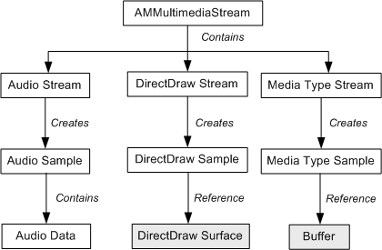
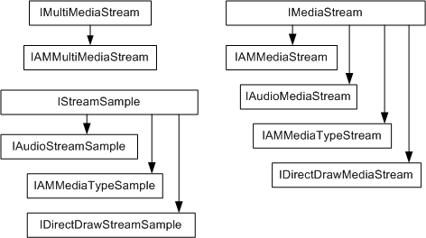

# Multimedia Streaming Object and Interface Hierarchy

> [!Note]  
> These APIs are deprecated. Applications should use the [**Sample Grabber**](sample-grabber-filter.md) filter or implement a custom filter to get data from a DirectShow filter graph.

 

The following diagram shows the object hierarchy used in multimedia streaming.

The multimedia streaming architecture defines three general type of object:

-   The **AMMultimediaStream** object exposes the [**IAMMultiMediaStream**](/previous-versions/windows/desktop/api/amstream/nn-amstream-iammultimediastream) interface. Internally, this object wraps the DirectShow filter graph.
-   *Media stream* objects expose the [**IMediaStream**](/previous-versions/windows/desktop/api/mmstream/nn-mmstream-imediastream) interface and are data specific. The AMMultimediaStream object contains one or more media streams.
-   *Stream sample* objects contain the data for a particular stream.

The following media stream objects are supported:

-   Audio stream. Exposes the [**IAudioMediaStream**](/previous-versions/windows/desktop/api/austream/nn-austream-iaudiomediastream) interface.
-   DirectDraw stream. Represents a video stream that is rendered to a DirectDraw surface. Exposes the [**IDirectDrawMediaStream**](/previous-versions/windows/desktop/api/ddstream/nn-ddstream-idirectdrawmediastream) interface.
-   Media type stream. Represents arbitrary data. Exposes the [**IAMMediaTypeStream**](/previous-versions/windows/desktop/api/amstream/nn-amstream-iammediatypestream) interface.

Each media stream object creates its own kind of stream sample object:

-   Audio streams create audio samples, which expose the [**IAudioStreamSample**](/previous-versions/windows/desktop/api/austream/nn-austream-iaudiostreamsample) interface.
-   DirectDraw streams create DirectDraw samples, which expose the [**IDirectDrawStreamSample**](/previous-versions/windows/desktop/api/ddstream/nn-ddstream-idirectdrawstreamsample) interface.
-   Media type streams create media type samples, which expose the [**IAMMediaTypeSample**](/previous-versions/windows/desktop/api/amstream/nn-amstream-iammediatypesample) interface.

The following diagram shows the interface hierarchy for the interfaces listed previously:

 

 

