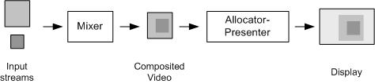
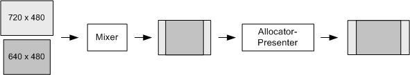

# Non-Square Mixing

\[The feature associated with this page, [DirectShow](/windows/win32/directshow/directshow), is a legacy feature. It has been superseded by [MediaPlayer](/uwp/api/Windows.Media.Playback.MediaPlayer), [IMFMediaEngine](/windows/win32/api/mfmediaengine/nn-mfmediaengine-imfmediaengine), and [Audio/Video Capture in Media Foundation](/windows/win32/medfound/audio-video-capture-in-media-foundation). Those features have been optimized for Windows 10 and Windows 11. Microsoft strongly recommends that new code use **MediaPlayer**, **IMFMediaEngine** and **Audio/Video Capture in Media Foundation** instead of **DirectShow**, when possible. Microsoft suggests that existing code that uses the legacy APIs be rewritten to use the new APIs if possible.\]

This topic applies to Windows XP Service Pack 2 or later.

When the VMR-9 mixes two or more streams, there are two points where scaling can occur: When the mixer composites the input streams, and when the allocator-presenter renders the composited image.



Previous versions of the VMR-9 always composited the input streams using a square (1:1) pixel aspect ratio (PAR), even when there was only a single video stream. If the input stream had non-square pixels, this caused an unnecessary scaling operation. Scaling should be avoided as much as possible, of course, because it degrades the final image quality.

Starting in Windows XP Service Pack 2, the VMR-9 supports two different ways to avoid the problem of double scaling:

-   Implement a custom allocator-presenter and support the [**IVMRSurfaceAllocatorEx9**](/previous-versions/windows/desktop/api/Vmr9/nn-vmr9-ivmrsurfaceallocatorex9) interface.
-   Use non-square mixing mode.

This section describes non-square mixing mode. Applications can combine both techniques.

**How Non-Square Mixing Works**

In non-square mixing mode, the VMR-9 selects one input stream to be the target size and PAR. The VMR's mixer does not scale the video from that stream or from any other streams with the same image size and PAR. Streams with a different size or aspect ratio are scaled to match the target PAR and letterboxed to fit the final output image size.

The choice of streams depends on the current mixing mode:

-   YUV mixing mode is restricted to one video stream on pin 0. (The other pins may have subpicture or closed caption streams.) Therefore, the VMR-9 always selects pin 0 for the target image size and PAR.
-   In RGB mixing mode, the VMR selects the stream with the largest image size. If there is more than one, it selects the one with the highest z-order; and if there is still a tie, it selects the stream with the lowest pin number.

**Examples of Operation**

**Example 1.** Stream 0 is 720 x 480 pixels with a picture aspect ratio of 16:9. Stream 1 is a 640 x 480 pixels with a picture aspect ratio of 4:3.

In this example, stream 0 has the largest image size, so the VMR chooses this stream, regardless of RGB mixing mode or YUB mixing mode. The PAR is 32:27 (16:9 / 720:480), meaning the image must be stretched horizontally by this ratio to produce the correct 16:9 picture aspect ratio.

To match the target PAR, the VMR mixer scales stream 1 by the inverse ratio (27:32), resulting in a 540 x 480 image. The two streams are then composited onto one surface. To display the resulting image correctly, the allocator presenter must stretch the image horizontally to fit the 16:9 picture aspect ratio.



**Example 2.** Stream 0 is 720 x 480 pixels with a picture aspect ratio of 16:9. Stream 1 is a 1024 x 768 pixels with a picture aspect ratio of 4:3.

If the VMR-9 is using YUV mixing mode, it always selects stream 0. Therefore, it stretches stream 1 to 540 x 480 pixels, to match the PAR of stream 0.

If the VMR-9 is using RGB mixing mode, it selects stream 1 as the target, because that stream has the largest image size. It stretches stream 0 to an image size of 1024 x 576 pixels. Note that in this case, the composited image has a PAR of 1:1, so the allocator-presenter does not have to correct for non-square pixels. (It might still need to stretch the video to account for the destination rectangle.)

**Using Non-Square Mixing Mode**

Non-square mixing mode is recommended if either of the following conditions are true:

-   Your application never sends more than one video stream to the VMR-9.
-   Your application renders DVD, television, or ms-dvr files. You should also use YUV mixing mode in this case, if the graphics hardware supports it.

If your application mixes multiple video streams that may have varying image sizes or pixel aspect ratios, the default square mixing mode is recommended.

To configure non-square mixing mode, the filter graph must be stopped and all input pins disconnected on the VMR-9. Then call [**IVMRMixerControl9::SetMixingPrefs**](/previous-versions/windows/desktop/api/Vmr9/nf-vmr9-ivmrmixercontrol9-setmixingprefs) with the MixerPref9\_NonSquareMixing flag:


```C++
DWORD dwPrefs;
pMixControl->GetMixingPrefs(&dwPrefs);  
dwPrefs |= MixerPref9_NonSquareMixing;
pMixControl->SetMixingPrefs(dwPrefs);
```


> [!Note]  
> If you combine the MixerPref9\_NonSquareMixing flag with the MixerPref9\_ARAdjustXorY flag, the VMR-9 ignores the MixerPref9\_ARAdjustXorY flag.

 

If your application uses a custom allocator-presenter with non-square mixing mode, be aware that the composited image may have a non-square PAR. The allocator-presenter must scale the image to a square (1:1) PAR.

**Static Bitmaps**

If you use the [**IVMRMixerBitmap9**](/previous-versions/windows/desktop/api/Vmr9/nn-vmr9-ivmrmixerbitmap9) interface to blend a static bitmap onto the video, you should consider the bitmap to be a second video stream for purposes of the VMR mixing mode.

The VMR treats the bitmap as having the same PAR as the target. It does not scale the bitmap to adjust for the target's pixel aspect ratio. In the VMR's default configuration, the target has a 1:1 PAR, which matches most bitmaps. In non-square mixing mode, the target might have non-square pixels. To ensure that the bitmap is displayed correctly, the application should supply an image whose PAR matches the target PAR.

## Related topics

<dl> <dt>

[Using VMR Mixing Mode](using-vmr-mixing-mode.md)
</dt> </dl>

 

 


