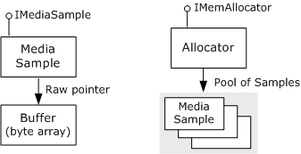
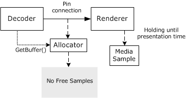
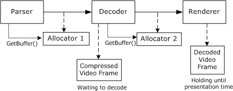

# Overview of Data Flow in DirectShow

This section gives a broad overview of how data flow works in DirectShow. Details can be found in other sections of the documentation.

Data is held in buffers, which are simply arrays of bytes. Each buffer is wrapped by a COM object called a *media sample*, which implements the [**IMediaSample**](/windows/desktop/api/Strmif/nn-strmif-imediasample) interface. Samples are created by another type of object, called an allocator, which implements the [**IMemAllocator**](/windows/desktop/api/Strmif/nn-strmif-imemallocator) interface. An allocator is assigned for every pin connection, although two or more pin connections might share the same allocator. The following image illustrates this process.

Each allocator creates a pool of media samples and allocates the buffers for each sample. Whenever a filter needs to fill a buffer with data, it requests a sample from the allocator by calling [**IMemAllocator::GetBuffer**](/windows/desktop/api/Strmif/nf-strmif-imemallocator-getbuffer). If the allocator has any samples that are not currently in use by another filter, the **GetBuffer** method returns immediately with a pointer to the sample. If all of the allocator's samples are in use, the method blocks until a sample becomes available. When the method does return a sample, the filter puts data into the buffer, sets the appropriate flags on the sample (typically including a time stamp), and delivers the sample downstream.

When a renderer filter receives a sample, it checks the time stamp and holds onto the sample until the filter graph's reference clock indicates that the data should be rendered. After the filter renders the data, it releases the sample. The sample does not go back into the allocator's pool of samples until the sample's reference count is zero, meaning that every filter has released the sample. The following image illustrates this process.

The upstream filter might run ahead of the renderer — that is, it might fill buffers faster than the renderer consumes them. Even so, samples do not get rendered early, because the renderer holds each until its presentation time. Moreover, the upstream filter will not overwrite buffers accidentally, because **GetSample** only returns samples that are not otherwise in use. The amount by which the upstream filter can run ahead is determined by the number of samples in the allocator's pool.

The previous diagram only shows one allocator, but typically there are several allocators per stream. Thus, when the renderer releases a sample, it can have a cascading effect. The following diagram shows a situation where a decoder holds a compressed video frame while it waits for the renderer to release a sample. A parser filter is also waiting for the decoder to release a sample.

When the renderer releases its sample, the decoder's pending call to **GetBuffer** returns. The decoder can then decode the compressed video frame and release the sample it was holding, thereby unblocking the parser's pending **GetBuffer** call.

## Related topics

<dl> <dt>

[Data Flow in the Filter Graph](data-flow-in-the-filter-graph.md)
</dt> </dl>

 

 

