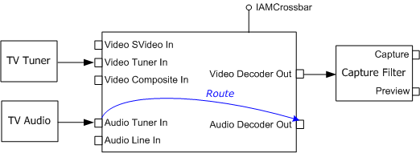

# Previewing TV Audio

To preview TV audio, route the Audio Decoder pin on the crossbar filter to the Audio Tuner pin. To mute the audio, route the Audio Decoder pin to -1, as shown in the following diagram. (Crossbar filters are described in [Working with Crossbars](working-with-crossbars.md).)



The basic approach is as follows:

1.  Use the [**ICaptureGraphBuilder2::FindInterface**](/windows/desktop/api/Strmif/nf-strmif-icapturegraphbuilder2-findinterface) method to locate the crossbar filter.
2.  Use the [**IAMCrossbar::get\_CrossbarPinInfo**](/windows/desktop/api/Strmif/nf-strmif-iamcrossbar-get_crossbarpininfo) method to enumerate the crossbar filter's input and output pins. Search for an audio decoder output pin and an audio tuner input pin.
3.  If you find the correct pins, call [**IAMCrossbar::Route**](/windows/desktop/api/Strmif/nf-strmif-iamcrossbar-route) to route the pins. If not, look upstream for another crossbar and repeat the process.
4.  To mute the audio, route the audio decoder pin to -1.

Most TV tuners use a single crossbar filter, but some use two crossbar filters. Therefore, you might have to search for a second crossbar if the first one fails.

> [!Note]  
> Contrary to what you might expect, no audio capture filter or audio renderer is required to preview the audio, because there is a physical connection between the tuner card and the sound card.

 

The following code shows these steps in more detail. First, here is a helper function that searches a crossbar filter for a specified pin type:


```C++
HRESULT FindCrossbarPin(
    IAMCrossbar *pXBar,                 // Pointer to the crossbar.
    PhysicalConnectorType PhysicalType, // Pin type to match.
    PIN_DIRECTION Dir,                  // Pin direction.
    long *pIndex)       // Receives the index of the pin, if found.
{
    BOOL bInput = (Dir == PINDIR_INPUT ? TRUE : FALSE);

    // Find out how many pins the crossbar has.
    long cOut, cIn;
    HRESULT hr = pXBar->get_PinCounts(&cOut, &cIn);
    if (FAILED(hr)) return hr;
    // Enumerate pins and look for a matching pin.
    long count = (bInput ? cIn : cOut);
    for (long i = 0; i < count; i++)
    {
        long iRelated = 0;
        long ThisPhysicalType = 0;
        hr = pXBar->get_CrossbarPinInfo(bInput, i, &iRelated,
            &ThisPhysicalType);
        if (SUCCEEDED(hr) && ThisPhysicalType == PhysicalType)
        {
            // Found a match, return the index.
            *pIndex = i;
            return S_OK;
        }
    }
    // Did not find a matching pin.
    return E_FAIL;
}
```


The next function attempts to activate or mute the audio, depending on the value of the *bActivate* parameter. It searches the specified crossbar filter for the required pins. If it cannot find them, it returns an error code.


```C++
HRESULT ConnectAudio(IAMCrossbar *pXBar, BOOL bActivate)
{
    // Look for the Audio Decoder output pin.
    long i = 0;
    HRESULT hr = FindCrossbarPin(pXBar, PhysConn_Audio_AudioDecoder,
        PINDIR_OUTPUT, &i);
    if (SUCCEEDED(hr))
    {
        if (bActivate)  // Activate the audio. 
        {
            // Look for the Audio Tuner input pin.
            long j = 0;
            hr = FindCrossbarPin(pXBar, PhysConn_Audio_Tuner, 
                PINDIR_INPUT, &j);
            if (SUCCEEDED(hr))
            {
                return pXBar->Route(i, j);
            }
        }
        else  // Mute the audio
        {
            return pXBar->Route(i, -1);
        }
    }
    return E_FAIL;
}
```


The next function searches the filter graph for a crossbar filter. If it finds one, it attempts to activate or mute the audio (using the previous function). If that operation fails, the method searches upstream for a second crossbar and tries again. For a more generalized approach to managing multiple crossbar filters in a graph, see the CCrossbar class in the AmCap sample application.


```C++
HRESULT ActivateAudio(ICaptureGraphBuilder2 *pBuild, IBaseFilter *pSrc,
  BOOL bActivate)
{
    // Search upstream for a crossbar.
    IAMCrossbar *pXBar1 = NULL;
    HRESULT hr = pBuild->FindInterface(&LOOK_UPSTREAM_ONLY, NULL, pSrc,
        IID_IAMCrossbar, (void**)&pXBar1);
    if (SUCCEEDED(hr)) 
    {
        hr = ConnectAudio(pXBar1, bActivate);
        if (FAILED(hr))
        {
            // Look for another crossbar.
            IBaseFilter *pF = NULL;
            hr = pXBar1->QueryInterface(IID_IBaseFilter, (void**)&pF);
            if (SUCCEEDED(hr)) 
            {
                // Search upstream for another one.
                IAMCrossbar *pXBar2 = NULL;
                hr = pBuild->FindInterface(&LOOK_UPSTREAM_ONLY, NULL, pF,
                    IID_IAMCrossbar, (void**)&pXBar2);
                pF->Release();
                if (SUCCEEDED(hr))
                {
                    hr = ConnectAudio(pXBar2, bActivate);
                    pXBar2->Release();
                }
            }
        }
        pXBar1->Release();
    }
    return hr;
}
```


The following code shows how to call these functions:


```C++
// Build the analog TV graph (not shown).
// Activate the audio.
hr = ActivateAudio(pBuild, pCap, TRUE);
// Later, mute the audio.
hr = ActivateAudio(pBuild, pCap, FALSE);
```


Note that these example functions repeat many of the same function calls. For example, they enumerate the crossbar pins each time. In a real application, you might cache some of this information.

## Related topics

<dl> <dt>

[Analog Television Audio](analog-television-audio.md)
</dt> <dt>

[Working with Crossbars](working-with-crossbars.md)
</dt> </dl>

 

 


