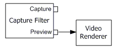

# Previewing Video (DirectShow)

To build a video preview graph, call the [**ICaptureGraphBuilder2::RenderStream**](/windows/desktop/api/Strmif/nf-strmif-icapturegraphbuilder2-renderstream) method as follows:


```C++
ICaptureGraphBuilder2 *pBuild; // Capture Graph Builder
// Initialize pBuild (not shown).

IBaseFilter *pCap; // Video capture filter.

/* Initialize pCap and add it to the filter graph (not shown). */

hr = pBuild->RenderStream(&PIN_CATEGORY_PREVIEW, &MEDIATYPE_Video, 
    pCap, NULL, NULL);
```


This example assumes the following:

-   *pBuild* was initialized, as described in [About the Capture Graph Builder](about-the-capture-graph-builder.md).
-   *pCap* was initialized, by creating an instance of the capture filter and adding it to the filter graph, as described in [Selecting a Capture Device](selecting-a-capture-device.md).

The first parameter to the [**ICaptureGraphBuilder2::RenderStream**](/windows/desktop/api/Strmif/nf-strmif-icapturegraphbuilder2-renderstream) method specifies a pin category; for a preview graph, use **PIN\_CATEGORY\_PREVIEW**. The second parameter specifies a media type, as a major type GUID. For video, use **MEDIATYPE\_Video**. DV devices deliver interleaved audio and video, for which the media type is **MEDIATYPE\_Interleaved**. (For more information about DV capture, see [Digital Video in DirectShow](digital-video-in-directshow.md).)

The third parameter is a pointer to the capture filter's [**IBaseFilter**](/windows/desktop/api/Strmif/nn-strmif-ibasefilter) interface. The next two parameters are not needed in this example. They are used to specify additional filters that might be needed to render the stream. Setting the last parameter to **NULL** causes the Capture Graph Builder to select a default renderer for the stream, based on the media type. For video, the Capture Graph Builder always uses the [Video Renderer](video-renderer-filter.md) filter as the default renderer.

> [!Note]  
> In Windows XP and later, although the Video Mixing Renderer (VMR) is the default video renderer for [**IGraphBuilder**](/windows/desktop/api/Strmif/nn-strmif-igraphbuilder) methods, it is not the default renderer for the [**RenderStream**](/windows/desktop/api/Strmif/nf-strmif-icapturegraphbuilder2-renderstream) method. On any platform, the Capture Graph Builder always uses the old Video Renderer filter unless you specify otherwise.

 

Although the pin category is given as **PIN\_CATEGORY\_PREVIEW**, it does not matter whether the filter actually has a preview pin; it could have a video port pin or just a capture pin. In either case, the Capture Graph Builder automatically builds the correct graph.

The following diagram shows the simplest possible graph for previewing video.



In this diagram, the capture filter has a preview pin, which connects directly to the video renderer.

If the capture filter has only a capture pin, the Capture Graph Builder inserts a [Smart Tee](smart-tee-filter.md) filter, which splits the stream into a capture stream and a preview stream. This is described in more detail in [Combining Video Capture and Preview](combining-video-capture-and-preview.md).

In some cases, the video stream must go through the Overlay Mixer filter. If so, the [**RenderStream**](/windows/desktop/api/Strmif/nf-strmif-icapturegraphbuilder2-renderstream) method adds it to the graph automatically.

## Related topics

<dl> <dt>

[Combining Video Capture and Preview](combining-video-capture-and-preview.md)
</dt> <dt>

[Video Capture](video-capture.md)
</dt> </dl>

 

 


