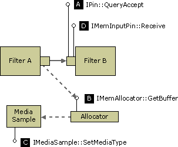

# QueryAccept (Downstream)

\[The feature associated with this page, [DirectShow](/windows/win32/directshow/directshow), is a legacy feature. It has been superseded by [MediaPlayer](/uwp/api/Windows.Media.Playback.MediaPlayer), [IMFMediaEngine](/windows/win32/api/mfmediaengine/nn-mfmediaengine-imfmediaengine), and [Audio/Video Capture in Media Foundation](windows/win32/medfound/audio-video-capture-in-media-foundation). Those features have been optimized for Windows 10 and Windows 11. Microsoft strongly recommends that new code use **MediaPlayer**, **IMFMediaEngine** and **Audio/Video Capture in Media Foundation** instead of **DirectShow**, when possible. Microsoft suggests that existing code that uses the legacy APIs be rewritten to use the new APIs if possible.\]

This mechanism enables an output pin to propose a new format to its downstream peer. The new format must not require a larger buffer size. The output pin does the following:

1.  Calls [**IPin::QueryAccept**](/windows/desktop/api/Strmif/nf-strmif-ipin-queryaccept) or [**IPinConnection::DynamicQueryAccept**](/windows/desktop/api/Strmif/nf-strmif-ipinconnection-dynamicqueryaccept) on the downstream pin, to verify whether the other pin can accept the new media type (see illustration, step A).
2.  If the return value from step 1 is S\_OK, the pin attaches the media type to the next sample. To do this, first it calls [**IMemAllocator::GetBuffer**](/windows/desktop/api/Strmif/nf-strmif-imemallocator-getbuffer) to obtain the sample (B). Then it calls [**IMediaSample::SetMediaType**](/windows/desktop/api/Strmif/nf-strmif-imediasample-setmediatype) to attach the media type to that sample (C). By attaching the media type to the sample, the filter indicates that the format has changed, starting with that sample.
3.  The pin delivers the sample (D).
4.  When the downstream filter receives the sample, it calls [**IMediaSample::GetMediaType**](/windows/desktop/api/Strmif/nf-strmif-imediasample-getmediatype) to retrieve the new media type.

    

All pins support the `QueryAccept` method. However, this method is slightly ambiguous, because a return value of S\_OK does not always guarantee that you can change the format while the graph is active. Some filters might return S\_OK but reject the change if the graph is active. The **DynamicQueryAccept** method, which is supported by some input pins, explicitly defines S\_OK to mean the pin can change formats while active. If an input pin supports the **IPinConnection** interface, you should call **DynamicQueryAccept** rather than `QueryAccept`.

In most cases, this mechanism does not allow for drastic changes to the format, such as changing the bit depth. One situation in which it can be used is when a video decoder switches palettes. The basic details of the format stay the same, such as the image dimensions and the bit depth, but the new media type has a different set of palette entries.

**Implementation Note**

In the DirectShow base classes, [**CBasePin::QueryAccept**](cbasepin-queryaccept.md) calls the **CheckMediaType** method, which is also called during the initial pin connection. In the case of a transform filter, the input pin's **CheckMediaType** method should always check whether the output pin is connected, and if so, whether the input media type is compatible with the output media type. Therefore, this implementation will likely be valid for `QueryAccept`. If not, you should override `QueryAccept` in order to perform any additional checks that are needed. Also, note that the [**CTransformFilter**](ctransformfilter.md) class encapsulates this logic within the **CheckInputType** and **CheckTransform** methods. The [**CTransInPlaceFilter**](ctransinplacefilter.md) class, on the other hand, always calls `QueryAccept` on the next upstream or downstream filter.

The [**CBaseInputPin::Receive**](cbaseinputpin-receive.md) method checks for a media type on the incoming sample, and if there is one, calls **CheckMediaType**. However, it does not update the pin's **m\_mt** member, which holds the current media type. When your filter processes the sample, you should check the sample for a media type. If there is a new type, you will probably need to store it, either by calling **SetMediaType** on your pin or by setting the value of **m\_mt** directly. On the other hand, the [**CVideoTransformFilter**](cvideotransformfilter.md) class, which is designed for video transform filters, stores the media type when it changes. For details, see the source code for [**CVideoTransformFilter::Receive**](cvideotransformfilter-receive.md) in the DirectShow base class library.

In some cases, you might simply pass the `QueryAccept` call downstream, then attach the media type to the output sample and let the downstream filter handle the format change.

 

 

