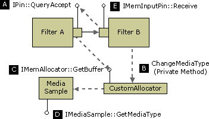

# QueryAccept (Upstream)

This mechanism enables an input pin to propose a format change to its upstream peer. The downstream filter must attach a media type to the sample that the upstream filter will obtain in its next call to [**IMemAllocator::GetBuffer**](/windows/desktop/api/Strmif/nf-strmif-imemallocator-getbuffer). In order to do this, however, the downstream filter must provide a custom allocator for the connection. This allocator must implement a private method that the downstream filter can use to set the media type on the next sample.

The following steps occur:

1.  The downstream filter checks whether the pin connection uses the filter's custom allocator. If the upstream filter owns the allocator, the downstream filter cannot change the format.
2.  The downstream filter calls [**IPin::QueryAccept**](/windows/desktop/api/Strmif/nf-strmif-ipin-queryaccept) on the upstream output pin (see illustration, step A).
3.  If `QueryAccept` returns S\_OK, the downstream filter calls the private method on its allocator in order to set the media type. Within this private method, the allocator calls [**IMediaSample::SetMediaType**](/windows/desktop/api/Strmif/nf-strmif-imediasample-setmediatype) on the next available sample (B).
4.  The upstream filter calls **GetBuffer** to get a new sample (C) and [**IMediaSample::GetMediaType**](/windows/desktop/api/Strmif/nf-strmif-imediasample-getmediatype) to get the media type (D).
5.  When the upstream filter delivers the sample, it should leave the media type attached to that sample. That way, the downstream filter can confirm that the media type has changed (E).

If the upstream filter accepts the format change, it must also be able to switch back to the original media type, as shown in the following diagram.



The main examples of this kind of format change involve the DirectShow video renderers.

-   The original [Video Renderer](video-renderer-filter.md) filter can switch between RGB and YUV types during streaming. When the filter connects, it requires an RGB format that matches the current display settings. This guarantees that it can fall back on GDI if it needs to. After streaming begins, if DirectDraw is available, the Video Renderer requests a format change to a YUV type. Later, it might switch back to RGB if it loses the DirectDraw surface for any reason.
-   The newer Video Mixing Renderer (VMR) filter will connect with any format that is supported by the graphics hardware, including YUV types. However, the graphics hardware might change the stride of the underlying DirectDraw surface in order to optimize performance. The VMR filter uses `QueryAccept` to report the new stride, which is specified in the **biWidth** member of the **BITMAPINFOHEADER** structure. The source and target rectangles in the **VIDEOINFOHEADER** or **VIDEOINFOHEADER2** structure identify the region where the video should be decoded.

**Implementation Note**

It is unlikely that you will write a filter that needs to request upstream format changes, since this is mainly a feature of video renderers. However, if you write a video transform filter or a video decoder, your filter must respond correctly to requests from the video renderer.

A trans-in-place filter that sits between the video renderer and the decoder should pass all `QueryAccept` calls upstream. Store the new format information when it arrives.

A copy-transform filter (that is, a non-trans-in-place filter) should implement one of the following behaviors:

-   Pass format changes upstream and store the new format information when it arrives. Your filter must use a custom allocator so that it can attach the format to the upstream sample.
-   Perform the format conversion inside the filter. This is probably easier than passing the format change upstream. However, it might be less efficient than letting the decoder filter decode into the correct format.
-   As a last resort, simply reject the format change. (For more information, refer to the source code for the [**CTransInPlaceOutputPin::CheckMediaType**](ctransinplaceoutputpin-checkmediatype.md) method in the DirectShow base class library.) Rejecting a format change can reduce performance, however, because it prevents the video renderer from using the most efficient format.

The following pseudo-code shows how you might implement a copy-transform filter (derived from **CTransformFilter**) that can switch between YUV and RGB output types. This example assumes that the filter does the conversion itself, rather than passing the format change upstream.


```C++
HRESULT CMyTransform::CheckInputType(const CMediaType *pmt)
{
    if (pmt is a YUV type that you support) {
        return S_OK;
    }
    else {
        return VFW_E_TYPE_NOT_ACCEPTED;
    }
}

HRESULT CMyTransform::CheckTransform(
    const CMediaType *mtIn, const CMediaType *mtOut)
{
    if (mtOut is a YUV or RGB type that you support)
    {
        if ((mtIn has the same video dimensions as mtOut) &&
            (you support the mtIn-to-mtOut transform))
        {
            return S_OK;
        }
    }
    // otherwise
    return VFW_E_TYPE_NOT_ACCEPTED;
}

// GetMediaType: Return a preferred output type.
HRESULT CMyTransform::GetMediaType(int iPosition, CMediaType *pMediaType)
{
    if (iPosition < 0) {
        return E_INVALIDARG;
    }
    switch (iPosition)
    {
    case 0:
        Copy the input type (YUV) to pMediaType
        return S_OK;
    case 1:
        Construct an RGB type that matches the input type.
        return S_OK;
    default:
        return VFW_S_NO_MORE_ITEMS;
    }
}

// SetMediaType: Override from CTransformFilter. 
HRESULT CMyTransform::SetMediaType(
    PIN_DIRECTION direction, const CMediaType *pmt)
{
    // Capture this information...
    if (direction == PINDIR_OUTPUT)
    {
       m_bYuv = (pmt->subtype == MEDIASUBTYPE_UYVY);
    }
    return S_OK;
}

HRESULT CMyTransform::Transform(
    IMediaSample *pSource, IMediaSample *pDest)
{
    // Look for format changes from downstream.
    CMediaType *pMT = NULL;
    HRESULT hr = pDest->GetMediaType((AM_MEDIA_TYPE**)&pMT);
    if (hr == S_OK)
    {
        hr = m_pOutput->CheckMediaType(pMT);
        if(FAILED(hr))
        {
            DeleteMediaType(pMT);
            return E_FAIL;
        }
        // Notify our own output pin about the new type.
        m_pOutput->SetMediaType(pMT);
        DeleteMediaType(pMT);
    }
    // Process the buffers
    if (m_bYuv) {
        return ProcessFrameYUV(pSource, pDest);
    }
    else {
        return ProcessFrameRGB(pSource, pDest);
    }
}
```


 

 


