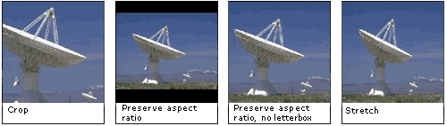

# Resize Flags

\[The feature associated with this page, [DirectShow](/windows/win32/directshow/directshow), is a legacy feature. It has been superseded by [MediaPlayer](/uwp/api/Windows.Media.Playback.MediaPlayer) and [IMFMediaEngine](/windows/win32/api/mfmediaengine/nn-mfmediaengine-imfmediaengine). **MediaPlayer** and **IMFMediaEngine** have been optimized for Windows 10 and Windows 11. Microsoft strongly recommends that new code use **MediaPlayer** and **IMFMediaEngine** instead of **DirectShow**, when possible. Microsoft suggests that existing code that uses the legacy APIs be rewritten to use the new APIs if possible.\]

\[Deprecated. This API may be removed from future releases of Windows.\]

These flags specify how a video source is rendered if its size does not match the output dimensions.

| Constant/value                                                                                                                                                                                                                                                                                      | Description                                                                                                                                                                                                                        |
|:----------------------------------------------------------------------------------------------------------------------------------------------------------------------------------------------------------------------------------------------------------------------------------------------------|:-----------------------------------------------------------------------------------------------------------------------------------------------------------------------------------------------------------------------------------|
| <dl> <dt>**RESIZEF\_STRETCH**</dt> <dt>0</dt> </dl>                                                                          | The image is stretched to fit the target frame size in both dimensions, without preserving the aspect ratio.                                                                                                             |
| <dl> <dt>**RESIZEF\_CROP**</dt> <dt>1</dt> </dl>                                                                                   | The image is not resized. If the image is smaller than the target frame, the surrounding area is black. If the image is larger than the target frame, the image is cropped.                                              |
| <dl> <dt>**RESIZEF\_PRESERVEASPECTRATIO**</dt> <dt>2</dt> </dl>                                      | The image is resized to fit the target frame along one dimension, while preserving the aspect ratio. If the ratio of width to height in the image does not match the ratio in the target frame, it creates a letterbox.  |
| <dl> <dt>**RESIZEF\_PRESERVEASPECTRATIO\_NOLETTERBOX**</dt> <dt>3</dt> </dl> | The image is resized to fill the entire target frame while preserving the aspect ratio. Rather than create a letterbox, this mode crops the image, either along the sides or across the top and bottom.                  |

## Remarks

The following images show the effects of these flags.

## Requirements

| Requirement | Value |
|-------------------|------------------------------------------------------------------------------------|
| Header  | <dl> <dt>Qedit.h</dt> </dl> |

## See also

<dl> <dt>

[**IAMTimelineSrc::GetStretchMode**](iamtimelinesrc-getstretchmode.md)
</dt> <dt>

[**IAMTimelineSrc::SetStretchMode**](iamtimelinesrc-setstretchmode.md)
</dt> </dl>

 

 

