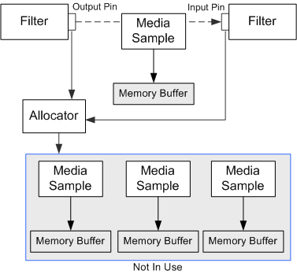

# Samples and Allocators

\[The feature associated with this page, [DirectShow](/windows/win32/directshow/directshow), is a legacy feature. It has been superseded by [MediaPlayer](/uwp/api/Windows.Media.Playback.MediaPlayer), [IMFMediaEngine](/windows/win32/api/mfmediaengine/nn-mfmediaengine-imfmediaengine), and [Audio/Video Capture in Media Foundation](/windows/win32/medfound/audio-video-capture-in-media-foundation). Those features have been optimized for Windows 10 and Windows 11. Microsoft strongly recommends that new code use **MediaPlayer**, **IMFMediaEngine** and **Audio/Video Capture in Media Foundation** instead of **DirectShow**, when possible. Microsoft suggests that existing code that uses the legacy APIs be rewritten to use the new APIs if possible.\]

When a pin delivers media data to another pin, it does not pass a direct pointer to the memory buffer. Instead, it delivers a pointer to a COM object that manages the memory. This object, called a *media sample*, exposes the [**IMediaSample**](/windows/desktop/api/Strmif/nn-strmif-imediasample) interface. The receiving pin accesses the memory buffer by calling **IMediaSample** methods, such as [**IMediaSample::GetPointer**](/windows/desktop/api/Strmif/nf-strmif-imediasample-getpointer), [**IMediaSample::GetSize**](/windows/desktop/api/Strmif/nf-strmif-imediasample-getsize), and [**IMediaSample::GetActualDataLength**](/windows/win32/api/strmif/nf-strmif-imediasample-getactualdatalength).

Samples always travel downstream, from output pin to input pin. In the push model, the output pin delivers a sample by calling [**IMemInputPin::Receive**](/windows/desktop/api/Strmif/nf-strmif-imeminputpin-receive) on the input pin. The input pin will either process the data synchronously (that is, completely inside the **Receive** method), or process it asynchronously on a worker thread. The input pin is allowed to block within the **Receive** method, if it needs to wait for resources.

Another COM object, called an *allocator*, is responsible for creating and managing media samples. Allocators expose the [**IMemAllocator**](/windows/desktop/api/Strmif/nn-strmif-imemallocator) interface. Whenever a filter needs a media sample with an empty buffer, it calls the [**IMemAllocator::GetBuffer**](/windows/desktop/api/Strmif/nf-strmif-imemallocator-getbuffer) method, which returns a pointer to the sample. Every pin connection shares one allocator. When two pins connect, they decide which filter will provide the allocator. The pins also set properties on the allocator, such as the number of buffers and the size of each buffer. (For details, see [How Filters Connect](how-filters-connect.md) and [Negotiating Allocators](negotiating-allocators.md).)

The following illustration shows the relationships among the allocator, the media samples, and the filter.

**Media Sample Reference Counts**

An allocator creates a finite pool of samples. At any time, some samples may be in use, while others are available for **GetBuffer** calls. The allocator uses reference counting to keep track of the samples. The **GetBuffer** method returns a sample with a reference count of 1. If the reference count goes to zero, the sample goes back into the allocator's pool, where it can be used in the next **GetBuffer** call. As long as the reference count remains above zero, the sample is not available to **GetBuffer**. If every sample belonging to the allocator is in use, the **GetBuffer** method blocks until a sample becomes available.

For example, suppose that an input pin receives a sample. If it processes the sample synchronously, inside the **Receive** method, it does not increment the reference count. After **Receive** returns, the output pin releases the sample, the reference count goes to zero, and the sample returns to the allocator's pool. On the other hand, if the input pin processes the sample on a worker thread, it increments the reference count before leaving the **Receive** method. The reference count is now 2. When the output pin releases the sample, the count goes to 1; the sample does not yet return to the pool. After the worker thread is done with the sample, it calls **Release** to free the sample. Now the sample returns to the pool.

When a pin receives a sample, it can copy the data to another sample, or it can modify the original sample and deliver that one to the next filter. Potentially, a sample can travel the entire length of the graph, each filter calling **AddRef** and **Release** in turn. Therefore, the output pin must never re-use a sample after it calls **Receive**, because a downstream filter may be using the sample. The output pin must always call **GetBuffer** to get a new sample.

This mechanism reduces the amount of memory allocation, because filters re-use the same buffers. It also prevents filters from accidentally writing over data that has not been processed, because the allocator maintains a list of available samples.

A filter can use separate allocators for input and output. It might do this if it expands the input data (for example, by decompressing it). If the output is no larger than the input, a filter might process the data in place, without copying it to a new sample. In that case, two or more pin connections can share one allocator.

**Committing and Decommitting Allocators**

When a filter first creates an allocator, the allocator has not reserved any memory buffers. At this point, any calls to the **GetBuffer** method will fail. When streaming starts, the output pin calls [**IMemAllocator::Commit**](/windows/desktop/api/Strmif/nf-strmif-imemallocator-commit), which commits the allocator, causing it to allocate memory. Pins can now call **GetBuffer**.

When streaming stops, the pin calls [**IMemAllocator::Decommit**](/windows/desktop/api/Strmif/nf-strmif-imemallocator-decommit), which decommits the allocator. All subsequent calls to **GetBuffer** fail until the allocator is committed again. Also, if any calls to **GetBuffer** are currently blocked waiting for a sample, they immediately return a failure code. The **Decommit** method may or may not free the memory, depending on the implementation. For example, the [**CMemAllocator**](cmemallocator.md) class waits until its destructor method to free memory.

## Related topics

<dl> <dt>

[Data Flow in the Filter Graph](data-flow-in-the-filter-graph.md)
</dt> </dl>

 

 
