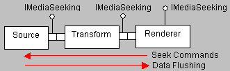

# Seeking

Filters support seeking through the [**IMediaSeeking**](/windows/desktop/api/Strmif/nn-strmif-imediaseeking) interface. The application queries the Filter Graph Manager for **IMediaSeeking** and uses it to issue seek commands. The Filter Graph Manager distributes each seek command to all of the renderer filters in the graph. Each renderer passes the command upstream, through the output pins of the upstream filters, until it reaches a filter that can execute the seek. Typically a source filter or parser filter, such as the [AVI Splitter](avi-splitter-filter.md), carries out the seek operation.

When a filter performs a seek operation, it flushes any pending data. The result is to minimize the latency of seek commands, because existing data is flushed from the graph. After a seek command, stream time resets to zero.

The following diagram illustrates the sequence of events.

If a parser filter has more than one output pin, it typically designates one of them to accept seek commands. The other pins reject or ignore any seek commands they receive. In this way, the parser keeps all of its streams synchronized. However, all output pins should implement [**IMediaSeeking::GetCapabilities**](/windows/desktop/api/Strmif/nf-strmif-imediaseeking-getcapabilities) and [**IMediaSeeking::CheckCapabilities**](/windows/desktop/api/Strmif/nf-strmif-imediaseeking-checkcapabilities) to return the filter's seeking capabilities. This ensures that the Filter Graph Manager returns the correct value to the application.

The [**IMediaPosition**](/windows/desktop/api/Control/nn-control-imediaposition) interface has been deprecated for filters. Automation clients still need to use this interface on the Filter Graph Manager, because **IMediaSeeking** is not Automation-compatible, but the Filter Graph Manager translates all **IMediaPosition** calls into **IMediaSeeking** calls.

## Related topics

<dl> <dt>

[Flushing](flushing.md)
</dt> <dt>

[Time and Clocks in DirectShow](time-and-clocks-in-directshow.md)
</dt> </dl>

 

 

