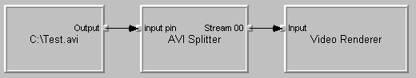

# Simulating Graph Building with GraphEdit

DirectShow provides a debugging utility called GraphEdit, which you can use to create and test filter graphs.

GraphEdit is a visual tool for building filter graphs. With GraphEdit, you can experiment with a filter graph before you write any application code. You can also load a filter graph that your application creates, to verify that your application is building the correct graph. If you develop a custom filter, GraphEdit provides a quick way to test it: Simply load a graph with your custom filter and try running the graph. If you are new to DirectShow, GraphEdit is a good way to become familiar with filter graphs and the DirectShow architecture.

The following illustration shows how GraphEdit represents a simple filter graph.

Each filter is represented as a rectangle. Smaller squares along the edges of the filters represent pins. Input pins are on the left side of the filter, and output pins are on the right side. The arrows represent the connections between pins.

With GraphEdit, you can:

-   Create and modify filter graphs using a visual, drag-and-drop interface.
-   Simulate programmatic calls to build a graph.
-   Run, pause, stop, and seek a graph.
-   See what filters are registered on your computer, and view registry information for each filter.
-   View filter property pages.
-   View the media types of pin connections.

This section contains the following topics:

-   [Using GraphEdit](using-graphedit.md)
-   [Loading a Graph From an External Process](loading-a-graph-from-an-external-process.md)
-   [Saving a Filter Graph to a GraphEdit File](saving-a-filter-graph-to-a-graphedit-file.md)
-   [Loading a GraphEdit File Programmatically](loading-a-graphedit-file-programmatically.md)
-   [GraphEdit File Format](graphedit-file-format.md)

## Related topics

<dl> <dt>

[Using DirectShow](using-directshow.md)
</dt> </dl>

 

 

