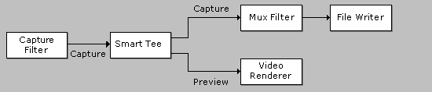

# Smart Tee Filter

\[The feature associated with this page, [DirectShow](/windows/win32/directshow/directshow), is a legacy feature. It has been superseded by [MediaPlayer](/uwp/api/Windows.Media.Playback.MediaPlayer), [IMFMediaEngine](/windows/win32/api/mfmediaengine/nn-mfmediaengine-imfmediaengine), and [Audio/Video Capture in Media Foundation](windows/win32/medfound/audio-video-capture-in-media-foundation). Those features have been optimized for Windows 10 and Windows 11. Microsoft strongly recommends that new code use **MediaPlayer**, **IMFMediaEngine** and **Audio/Video Capture in Media Foundation** instead of **DirectShow**, when possible. Microsoft suggests that existing code that uses the legacy APIs be rewritten to use the new APIs if possible.\]

The Smart Tee filter is used in video capture graphs to split the video stream into a preview stream and a capture stream. This is done without any additional data copying. The output pins support whatever media types are supported on the downstream connection.

The Smart Tee filter is useful when a video capture filter does not provide separate pins for capture and preview. The Smart Tee filter delivers preview data only if doing so does not hurt capture performance. It also removes the time stamps from the preview stream. The capture graph builder automatically inserts the Smart Tee filter when needed. For more information, see [Combining Video Capture and Preview](combining-video-capture-and-preview.md).

The following illustration shows a typical capture graph that uses the Smart Tee filter.

| Label | Value |
|------------------------------------------|----------------------------------------------------------------------------------------------------------------|
| Filter Interfaces                        | [**IBaseFilter**](/windows/desktop/api/Strmif/nn-strmif-ibasefilter)                                                                             |
| Input Pin Media Types                    | MEDIATYPE\_Video, MEDIASUBTYPE\_NULL                                                                           |
| Input Pin Interfaces                     | [**IMemInputPin**](/windows/desktop/api/Strmif/nn-strmif-imeminputpin), [**IPin**](/windows/desktop/api/Strmif/nn-strmif-ipin), [**IQualityControl**](/windows/desktop/api/Strmif/nn-strmif-iqualitycontrol)         |
| Output Pin Media Types                   | MEDIATYPE\_Video, MEDIASUBTYPE\_NULL                                                                           |
| Output Pin Interfaces                    | [**IAMStreamControl**](/windows/desktop/api/Strmif/nn-strmif-iamstreamcontrol), [**IPin**](/windows/desktop/api/Strmif/nn-strmif-ipin), [**IQualityControl**](/windows/desktop/api/Strmif/nn-strmif-iqualitycontrol) |
| Filter CLSID                             | CLSID\_SmartTee                                                                                                |
| Property Page CLSID                      | No property page.                                                                                              |
| Executable                               | qcap.dll                                                                                                       |
| [Merit](merit.md)                       | MERIT\_DO\_NOT\_USE                                                                                            |
| [Filter Category](filter-categories.md) | CLSID\_LegacyAmFilterCategory                                                                                  |

 

## Remarks

The capture pin is output pin 0, and the preview pin is output pin 1.

## Related topics

<dl> <dt>

[DirectShow Filters](directshow-filters.md)
</dt> </dl>

 

 

