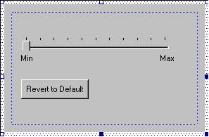

# Step 4. Create the Property Page

\[The feature associated with this page, [DirectShow](/windows/win32/directshow/directshow), is a legacy feature. It has been superseded by [MediaPlayer](/uwp/api/Windows.Media.Playback.MediaPlayer), [IMFMediaEngine](/windows/win32/api/mfmediaengine/nn-mfmediaengine-imfmediaengine), and [Audio/Video Capture in Media Foundation](windows/win32/medfound/audio-video-capture-in-media-foundation). Those features have been optimized for Windows 10 and Windows 11. Microsoft strongly recommends that new code use **MediaPlayer**, **IMFMediaEngine** and **Audio/Video Capture in Media Foundation** instead of **DirectShow**, when possible. Microsoft suggests that existing code that uses the legacy APIs be rewritten to use the new APIs if possible.\]

At this point the filter supports everything that it needs for a property page. The next step is implementing the property page itself. Start by deriving a new class from **CBasePropertyPage**. The following example shows part of the declaration, including some private member variables that will be used later in the example:


```C++
class CGrayProp : public CBasePropertyPage
{
private:
    ISaturation *m_pGray;    // Pointer to the filter's custom interface.
    long        m_lVal       // Store the old value, so we can revert.
    long        m_lNewVal;   // New value.
public:
    /* ... */
};
```


Next, create a dialog resource in the resource editor, along with a string resource for the dialog title. The string will appear in the tab for the property page. The two resource IDs are arguments to the **CBasePropertyPage** constructor:


```C++
CGrayProp::CGrayProp(IUnknown *pUnk) : 
  CBasePropertyPage(NAME("GrayProp"), pUnk, IDD_PROPPAGE, IDS_PROPPAGE_TITLE),
  m_pGray(0)
{ }
```


The following illustration shows the dialog resource for the example property page.



Now you are ready to implement the property page. Here are the methods in **CBasePropertyPage** to override:

-   **OnConnect** is called when the client creates the property page. It sets the **IUnknown** pointer to the filter.
-   **OnActivate** is called when the dialog is created.
-   **OnReceiveMessage** is called when the dialog receives a window message.
-   **OnApplyChanges** is called when the user commits the property changes by clicking the **OK** or **Apply** button.
-   **OnDisconnect** is called when the user dismisses the property sheet.

The remainder of this tutorial describes each of these methods.

Next: [Step 5. Store a Pointer to the Filter](step-5--store-a-pointer-to-the-filter.md).

## Related topics

<dl> <dt>

[Creating a Filter Property Page](creating-a-filter-property-page.md)
</dt> </dl>

 

 


