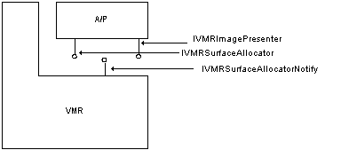
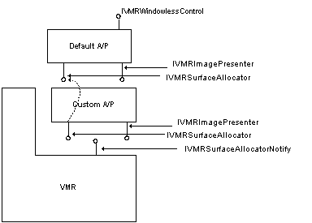

# Supplying a Custom Allocator-Presenter for VMR-7

The allocator-presenter is responsible for allocating DirectDraw surfaces and presenting the video frames for rendering. In the vast majority of scenarios, the functionality of the default allocator-presenter will be more than sufficient for an application's needs. But by plugging in a custom allocator-presenter, an application can obtain direct access to the video bits and completely control the rendering process. The trade-off for this increased power is that the application must handle the added complexity of DirectDraw surface management.

The preceding figure shows the communication interfaces used by the VMR and the allocator-presenter. A custom allocator-presenter that overrides all of the default allocation and presentation functionality must implement the [**IVMRImagePresenter**](/windows/win32/Strmif/nn-strmif-ivmrimagepresenter?branch=master) and [**IVMRSurfaceAllocator**](/windows/win32/Strmif/nn-strmif-ivmrsurfaceallocator?branch=master) interfaces, and optionally, [**IVMRWindowlessControl**](/windows/win32/Strmif/nn-strmif-ivmrwindowlesscontrol?branch=master).

To replace the default allocator-presenter, an application calls the [**IVMRSurfaceAllocatorNotify::AdviseSurfaceAllocator**](/windows/win32/Strmif/nf-strmif-ivmrsurfaceallocatornotify-advisesurfaceallocator?branch=master) method and passes in a pointer to the new allocator-presenter. In response to this call, the VMR will call the allocator-presenter's [**IVMRSurfaceAllocator::AdviseNotify**](/windows/win32/Strmif/nf-strmif-ivmrsurfaceallocator-advisenotify?branch=master) method to provide the pointer to the VMR's [**IVMRSurfaceAllocatorNotify**](/windows/win32/Strmif/nn-strmif-ivmrsurfaceallocatornotify?branch=master) interface. The allocator-presenter will use this interface pointer when passing events to the VMR with the [**IVMRSurfaceAllocatorNotify::NotifyEvent**](/windows/win32/Strmif/nf-strmif-ivmrsurfaceallocatornotify-notifyevent?branch=master) method.

As an alternate solution, an application can use both its own allocator-presenter and the default allocator-presenter. In this scenario, the custom allocator-presenter handles only those calls where custom functionality is needed, and passes the rest of the calls from the VMR through to the default allocator-presenter. In many cases, it is only necessary to override the [**IVMRImagePresenter**](/windows/win32/Strmif/nn-strmif-ivmrimagepresenter?branch=master) interface.

To use both a custom allocator-presenter and the default allocator-presenter, an application would first call [**IVMRSurfaceAllocatorNotify::AdviseSurfaceAllocator**](/windows/win32/Strmif/nf-strmif-ivmrsurfaceallocatornotify-advisesurfaceallocator?branch=master) to provide a pointer to the new allocator-presenter. This causes the default allocator-presenter to be destroyed, so the application must create another instance of it by calling **QueryInterface** on the VMR and requesting the [**IVMRSurfaceAllocator**](/windows/win32/Strmif/nn-strmif-ivmrsurfaceallocator?branch=master) interface. As shown in the preceding figure, the custom allocator-presenter overrides the [**IVMRImagePresenter**](/windows/win32/Strmif/nn-strmif-ivmrimagepresenter?branch=master) interface methods, and simply passes all calls to the **IVMRSurfaceAllocator** interface through to the default implementation. The figure also shows the [**IVMRWindowlessControl**](/windows/win32/Strmif/nn-strmif-ivmrwindowlesscontrol?branch=master) interface as being implemented on the allocator-presenter.

## Related topics

<dl> <dt>

[Supplying a Custom Allocator-Presenter for VMR-9](supplying-a-custom-allocator-presenter-for-vmr-9.md)
</dt> <dt>

[VMR Renderless Playback Mode (Custom Allocator-Presenters)](vmr-renderless-playback-mode--custom-allocator-presenters.md)
</dt> </dl>

 

 

