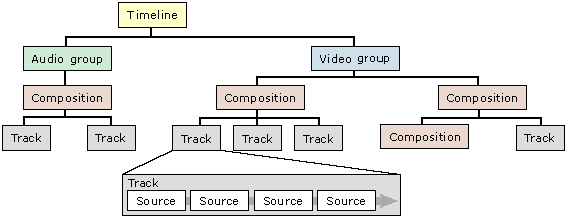
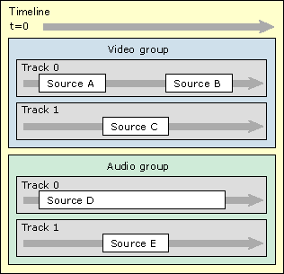

# The Timeline Model

\[This API is not supported and may be altered or unavailable in the future.\]

A *timeline* is an object that [DirectShow Editing Services](directshow-editing-services.md) (DES) uses to represent a video editing project. An editing project starts as a collection of source clips, taken from video files, sound files, or still image files. A linear sequence of clips forms a *track*. In DirectShow Editing Services (DES), audio and video are placed in separate tracks.

Tracks can also be layered. Multiple audio tracks are mixed together, and might include audio effects, such as fades or reverb. Multiple video tracks are used to create transitions. For example, you can create a wipe from one clip to another. Another example is a chroma key, in which the background of one clip is keyed out and replaced by a different track. (The weather forecaster in front of a satelite image is an example of chroma keying.)

DES uses a tree structure to represent an editing:

-   Audio and video clips form the leaf nodes, or *source* objects.
-   A collection of sources with a uniform media type (audio or video) is a *track*.
-   A collection of tracks is a *composition*. A composition is rendered as the composite of all the tracks it contains. Compositions can contain other compositions, which allows for complex arrangements of tracks.
-   A top-level collection of compositions and tracks (all representing the same media type) is a *group*.
-   A set of one or more groups forms a *timeline*. The timeline is the root node in the tree.

A timeline must contain at least one group. Each group represents a single stream in the final production. A typical project includes one video group and one audio group. Compositions are optional; they exist to provide more structure if needed.

The following illustration shows the child-parent relations that make up a timeline:

The following shows a timeline as a temporal sequence:

The arrow at the top represents the direction of the timeline, starting from time zero. Within the video group, track 1 has a higher priority than track 0. The source objects in track 1 obscure those in track 0. Where track 1 is empty, track 0 "shows through." As mentioned earlier, audio tracks are simply mixed together.

## Related topics

<dl> <dt>

[Getting Started with DirectShow Editing Services](getting-started-with-directshow-editing-services.md)
</dt> <dt>

[Constructing a Timeline](constructing-a-timeline.md)
</dt> </dl>

 

 

