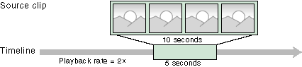

# Time in DirectShow Editing Services

\[The feature associated with this page, [DirectShow](/windows/win32/directshow/directshow), is a legacy feature. It has been superseded by [MediaPlayer](/uwp/api/Windows.Media.Playback.MediaPlayer), [IMFMediaEngine](/windows/win32/api/mfmediaengine/nn-mfmediaengine-imfmediaengine), and [Audio/Video Capture in Media Foundation](/windows/win32/medfound/audio-video-capture-in-media-foundation). Those features have been optimized for Windows 10 and Windows 11. Microsoft strongly recommends that new code use **MediaPlayer**, **IMFMediaEngine** and **Audio/Video Capture in Media Foundation** instead of **DirectShow**, when possible. Microsoft suggests that existing code that uses the legacy APIs be rewritten to use the new APIs if possible.\]

\[This API is not supported and may be altered or unavailable in the future.\]

To edit video, you must work with some important timing concepts. For example:

-   Each clip has a duration.
-   Clips, transitions, and effects appear at certain times in a project.
-   Video has a frame rate, expressed in frames per second (fps).

[DirectShow Editing Services](directshow-editing-services.md) (DES) provides various methods that set or retrieve times and frame rates. The meaning of these values depends on the context.

**Time Values**

When a parameter expresses a time, three distinct meanings are possible:

-   *Timeline time*: The time relative to the beginning of the timeline. For example, a clip might start 2 seconds into the timeline, or a transition might occur 15 seconds into the timeline. The timeline determines the final rendered project, so you can also think of timeline time as "project time."
-   *Media time*: A point in a source file relative to the start of the file, as reached during normal playback. For example, if you have a 10-second video file, the point midway through the file occurs at 5 seconds, expressed as a media time.
-   *Parent time*: Time relative to an object in the timeline. For example, if an object starts at 8 seconds on the timeline and contains another object that starts at 10 seconds on the timeline, the child object starts at 2 seconds relative to the parent. Virtual tracks all start at time zero, relative to the timeline. So for any object in a virtual track, parent time equals timeline time.

Media time applies only to source objects. Each source object has a media start time and a media stop time. For example, suppose you have a 10-second video clip, and you want to use only 5 seconds from the middle of the clip, trimming the first 2 seconds and the last 3 seconds from the clip. If you want the clip to appear 20 seconds into the project (and assuming a normal playback rate) you would specify the following start and stop times.

-   Media start: 2 seconds
-   Media stop: 7 seconds
-   Timeline start: 20 seconds
-   Timeline stop: 25 seconds

    

**Frame Rates**

Frame rate is the "speed" of a media stream, measured in frames per second. As with time values, the meaning of a frame rate depends on the context:

-   **Output frame rate:** The frame rate of the final rendered project, defined by the group. When you render the project, each group becomes a separate media stream with its own frame rate.
-   **Source frame rate:** The frame rate in which the source file was originally authored. The authored frame rate does not have to match the group's output frame rate. DES will automatically upsample or downsample the file as needed. For most media formats, DES can determine the frame rate by examining the format. A DIB sequence is an exception; you must specify the frame rate of a DIB sequence. (For more information, see [Working with Sources](working-with-sources.md).)

**Playback rate:** The apparent speed of a source clip when it appears in the project. For example, 10 seconds' of video can be fit into 5 seconds on the timeline. As a result, the speed of the clip increases by a factor of 2, as the following diagram illustrates.

(With an audio source, the pitch would shift as well.) The following formula determines a source clip's playback rate:

-   Playback rate = (Media Stop – Media Start) / (Timeline Stop – Timeline Start)

Note that each of these three rates is independent of the others:

-   You can speed up or slow down a clip by adjusting the media times; this does not affect the frame rate of the final output.
-   You can increase or decrease the output frame rate without affecting how fast a file plays.
-   You can mix, within the same group, source files that have different authored frame rates, and DES will upsample or downsample each clip to match the group's frame rate.

When you render a project, all times are rounded to the nearest frame boundary, as determined by the group frame rate. For example, suppose a video group has a frame rate of 30 fps. Each frame is roughly 33 milliseconds (ms). Suppose you add a 1.68-second source clip to the timeline, starting at time zero. The source does not end exactly on a frame boundary, so DES rounds the stop time to 1.6666 seconds (50 frames). If you seek to 1.68 seconds in the rendered project, you will actually seek past the end of the source, to the 51st frame.

However, DES does not overwrite the source's stop time. You might later change the group frame rate, or move the source to a new spot in the timeline where it rounds differently. Therefore, DES preserves the original stop time and rounds only when necessary. For more information, see [**IAMTimelineObj::FixTimes**](iamtimelineobj-fixtimes.md).

## Related topics

<dl> <dt>

[Getting Started with DirectShow Editing Services](getting-started-with-directshow-editing-services.md)
</dt> </dl>

 

 

