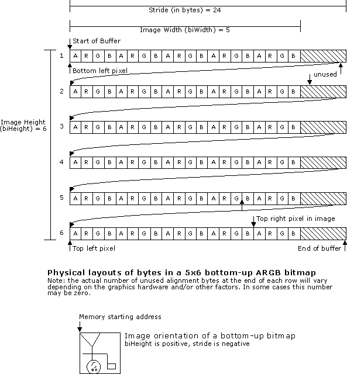
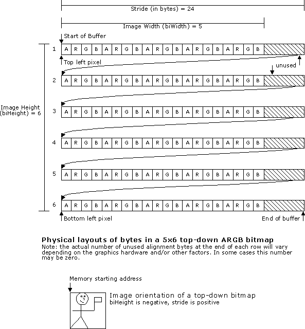

# Top-Down vs. Bottom-Up DIBs

\[The feature associated with this page, [DirectShow](/windows/win32/directshow/directshow), is a legacy feature. It has been superseded by [MediaPlayer](/uwp/api/Windows.Media.Playback.MediaPlayer), [IMFMediaEngine](/windows/win32/api/mfmediaengine/nn-mfmediaengine-imfmediaengine), and [Audio/Video Capture in Media Foundation](windows/win32/medfound/audio-video-capture-in-media-foundation). Those features have been optimized for Windows 10 and Windows 11. Microsoft strongly recommends that new code use **MediaPlayer**, **IMFMediaEngine** and **Audio/Video Capture in Media Foundation** instead of **DirectShow**, when possible. Microsoft suggests that existing code that uses the legacy APIs be rewritten to use the new APIs if possible.\]

If you are new to graphics programming, you might expect that a bitmap would be arranged in memory so that the top row of the image appeared at the start of the buffer, followed by the next row, and so forth. However, this is not necessarily the case. In Windows, device-independent bitmaps (DIBs) can be placed in memory in two different orientations, bottom-up and top-down.

In a bottom-up DIB, the image buffer starts with the bottom row of pixels, followed by the next row up, and so forth. The top row of the image is the last row in the buffer. Therefore, the first byte in memory is the bottom-left pixel of the image. In GDI, all DIBs are bottom-up. The following diagram shows the physical layout of a bottom-up DIB.

In a top-down DIB, the order of the rows is reversed. The top row of the image is the first row in memory, followed by the next row down. The bottom row of the image is the last row in the buffer. With a top-down DIB, the first byte in memory is the top-left pixel of the image. DirectDraw uses top-down DIBs. The following diagram shows the physical layout of a top-down DIB:

For RGB DIBs, the image orientation is indicated by the **biHeight** member of the [**BITMAPINFOHEADER**](/windows/win32/api/wingdi/ns-wingdi-bitmapinfoheader) structure. If **biHeight** is positive, the image is bottom-up. If **biHeight** is negative, the image is top-down.

DIBs in YUV formats are always top-down, and the sign of the **biHeight** member is ignored. Decoders should offer YUV formats with positive **biHeight**, but they should also accept YUV formats with negative **biHeight** and ignore the sign.

Also, any DIB type that uses a **FOURCC** in the **biCompression** member, should express its **biHeight** as a positive number no matter what its orientation is, since the **FOURCC** itself identifies a compression scheme whose image orientation should be understood by any compatible filter.

## Related topics

<dl> <dt>

[Working with Video Frames](working-with-video-frames.md)
</dt> </dl>

 

 

