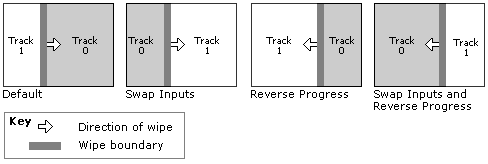

# Transition Direction

\[This API is not supported and may be altered or unavailable in the future.\]

A transition goes from input A to input B, and from time t₀ to t₁. Therefore, the *direction* of a transition can mean one of two things:

-   The mapping of timeline layers to inputs.
-   The progression over time.

The first is the *input direction*, and the second is the *progress direction*. You can control both directions.

-   Input direction: By default, a transition goes from the composite of the lower-priority layers to the layer that contains the transition. To reverse this direction, call the [**IAMTimelineTrans::SetSwapInputs**](iamtimelinetrans-setswapinputs.md) method.
-   Progress direction: Most transitions support a standard **Progress** property, which specifies what percentage of the transition is reflected in the output at a given moment. By default, the value of the **Progress** property goes from 0.0 to 1.0 over the duration of the transition. To reverse the progress, set the **Progress** property to go from 1.0 to 0.0.

The following diagram illustrates the difference between input direction and progress direction. It shows four variations on a standard [SMPTE Wipe](smpte-wipe-transition.md) transition.

The transition resides on track 1. By default, the wipe goes from left to right and from track 0 to track 1. Swapping inputs causes the wipe to go from track 1 to track 0, but still from left to right. Reversing the progress makes the transition go from right to left. You can combine both, as shown on the far left.

For more information about how DES renders transitions, see [The Timeline Model](the-timeline-model.md).

## Related topics

<dl> <dt>

[Working with Effects and Transitions](working-with-effects-and-transitions.md)
</dt> </dl>

 

 

