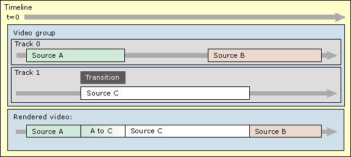
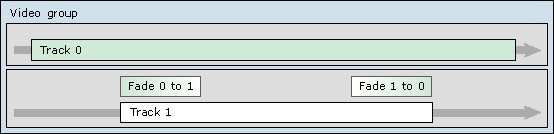

# Transitions

\[The feature associated with this page, [DirectShow](/windows/win32/directshow/directshow), is a legacy feature. It has been superseded by [MediaPlayer](/uwp/api/Windows.Media.Playback.MediaPlayer) and [IMFMediaEngine](/windows/win32/api/mfmediaengine/nn-mfmediaengine-imfmediaengine). **MediaPlayer** and **IMFMediaEngine** have been optimized for Windows 10 and Windows 11. Microsoft strongly recommends that new code use **MediaPlayer** and **IMFMediaEngine** instead of **DirectShow**, when possible. Microsoft suggests that existing code that uses the legacy APIs be rewritten to use the new APIs if possible.\]

\[This API is not supported and may be altered or unavailable in the future.\]

A transition is a way to segue from one video track to another, using a visual effect such as a fade or a wipe. The following illustration shows a timeline with a transition:

The transition object is on track 1, and it represents a transition from track 0 to track 1. At the start of the transition, the rendered video is entirely from Track 0 (source A). At the end, the video is entirely from Track 1 (source C). In between, the output transitions from source A to source C. For example, in a fade transition, one source progressively fades to the other. The final output is schematized along the bottom of the illustration.

Transitions cannot overlap in time within the same track, but you can create overlapping transitions by using the composition object, as described in [Composition and Layering](composition-and-layering.md).

A transition has a direction. By default, it starts from the lower priority track (source A, in the previous example.) and ends at the higher-priority track (source C). In between, the video is a mixture of the two sources. However, you can specify the opposite behavior, as shown in the following illustration:

Here, the first transition fades from track 0 fades track 1, which is the default behavior. The second transition fades from track 1 back to Track 0. Note that both transitions are located on track 1.

## Related topics

<dl> <dt>

[Getting Started with DirectShow Editing Services](getting-started-with-directshow-editing-services.md)
</dt> <dt>

[Transitions and Effects](transitions-and-effects.md)
</dt> <dt>

[Working with Effects and Transitions](working-with-effects-and-transitions.md)
</dt> </dl>

 

 

