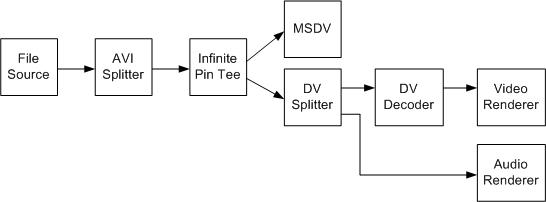

# Transmit from Type-1 File

\[The feature associated with this page, [DirectShow](/windows/win32/directshow/directshow), is a legacy feature. It has been superseded by [MediaPlayer](/uwp/api/Windows.Media.Playback.MediaPlayer), [IMFMediaEngine](/windows/win32/api/mfmediaengine/nn-mfmediaengine-imfmediaengine), and [Audio/Video Capture in Media Foundation](/windows/win32/medfound/audio-video-capture-in-media-foundation). Those features have been optimized for Windows 10 and Windows 11. Microsoft strongly recommends that new code use **MediaPlayer**, **IMFMediaEngine** and **Audio/Video Capture in Media Foundation** instead of **DirectShow**, when possible. Microsoft suggests that existing code that uses the legacy APIs be rewritten to use the new APIs if possible.\]

To transmit a type-1 file while previewing the file, use the filter graph shown in the following diagram.



Filters in this graph include:

-   The [AVI Splitter](avi-splitter-filter.md) parses the AVI file. For a type-1 DV file, the output pin delivers interleaved DV samples.
-   The [Infinite Pin Tee](infinite-pin-tee-filter.md) filter splits the interleaved DV into a transmit stream and a preview stream. Both streams contain the same interleaved data. (This graph uses the Infinite Pin Tee instead of the [Smart Tee](smart-tee-filter.md), because there is no danger of dropping frames when reading from a file, as there is with live capture.)
-   The [DV Splitter](dv-splitter-filter.md) splits the interleaved stream into a DV video stream, which is decoded by the [DV Video Decoder](dv-video-decoder-filter.md), and an audio stream. Both streams are rendererd for preview.

Build this graph as follows:


```C++
ICaptureGraphBuilder2 *pBuilder;  // Capture graph builder.
IBaseFilter           *pDV;       // DV capture filter (MSDV)

// Initialize pDV (not shown). 
// Create and initialize the Capture Graph Builder (not shown).

// Add the Infinite Pin Tee filter to the graph.
IBaseFilter *pTee;
hr = CoCreateInstance(CLSID_InfTee, 0, CLSCTX_INPROC_SERVER
    IID_IBaseFilter, reinterpret_cast<void**>)(&pTee));
hr = pGraph->AddFilter(pTee, L"Tee");

// Add the File Source filter to the graph.
IBaseFilter *pFileSource;
hr = pGraph->AddSourceFilter(
    L"C:\\YourFileNameHere.avi",
    L"Source", 
    &pFileSource);

// Add the AVI Splitter filter to the graph.
IBaseFilter *pAviSplit;
hr = CoCreateInstance(CLSID_AviSplitter, 0, CLSCTX_INPROC_SERVER
    IID_IBaseFilter, reinterpret_cast<void**>)(&pAviSplit));
hr = pGraph->AddFilter(pAviSplit, L"AVI Splitter");

// Connect the file source to the AVI Splitter.
hr = pBuilder->RenderStream(0, 0, pFileSource, 0, pAviSplit);
if (FAILED(hr))
{
    // This is not an AVI file. 
}

// Connect the file source to the Infinite Pin Tee.
hr = pBuilder->RenderStream(0, &MEDIATYPE_Interleaved, pAviSplit, 0, pTee);
if (FAILED(hr))
{
    // This is not a type-1 DV file.
}

// Render one stream from the Infinite Pin Tee to MSDV, for transmit.
hr = pBuilder->RenderStream(0, 0, pTee, 0, pDV);

// Render another stream from the Infinite Pin Tee for preview.
hr = pBuilder->RenderStream(0, 0, pTee, 0, 0);
```


1.  Call [**IGraphBuilder::AddSourceFilter**](/windows/desktop/api/Strmif/nf-strmif-igraphbuilder-addsourcefilter) to add the source filter to the filter graph.
2.  Create the AVI Splitter and the Infinite Pin Tee, and add them to the graph.
3.  Call [**ICaptureGraphBuilder2::RenderStream**](/windows/desktop/api/Strmif/nf-strmif-icapturegraphbuilder2-renderstream) to connect the source filter to the AVI Splitter. Specifying MEDIATYPE\_Interleaved to ensure that the method fails if the source file is not a type-1 DV file. In that case, you can back out and attempt to build a type-2 transmit graph instead.
4.  Call **RenderStream** again to route the interleaved stream from the AVI Splitter to the Infinite Pin Tee
5.  Call RenderStream a third time to route one stream from the Infinite Pin Tee to the MSDV filter, for transmit to the device.
6.  Call **RenderStream** one last time, to build the preview section of the graph.

If you do not want preview, simply connect the file source to the MSDV filter:


```C++
hr = pBuilder->RenderStream(0, &MEDIATYPE_Interleaved, pFileSource, 0, pDV);
```


## Related topics

<dl> <dt>

[Digital Video in DirectShow](digital-video-in-directshow.md)
</dt> </dl>

 

 


