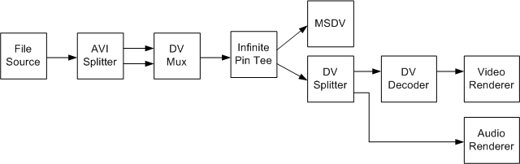

# Transmit from Type-2 File

\[The feature associated with this page, [DirectShow](/windows/win32/directshow/directshow), is a legacy feature. It has been superseded by [MediaPlayer](/uwp/api/Windows.Media.Playback.MediaPlayer) and [IMFMediaEngine](/windows/win32/api/mfmediaengine/nn-mfmediaengine-imfmediaengine). **MediaPlayer** and **IMFMediaEngine** have been optimized for Windows 10 and Windows 11. Microsoft strongly recommends that new code use **MediaPlayer** and **IMFMediaEngine** instead of **DirectShow**, when possible. Microsoft suggests that existing code that uses the legacy APIs be rewritten to use the new APIs if possible.\]

To transmit a type-2 file while previewing, use the filter graph shown in the following diagram.



A type-2 file has two streams, one audio stream and one DV-encoded video stream. This graph uses the [DV Muxer](dv-muxer-filter.md) filter to combine the audio and video streams. It sends the interleaved stream to the MSDV filter, but splits the stream again for preview.

Build this graph as follows:


```C++
// Add the DV Mux filter to the graph.
IBaseFilter *pDVMux;
hr = CoCreateInstance(CLSID_DVMux, 0, CLSCTX_INPROC_SERVER
    IID_IBaseFilter, reinterpret_cast<void**>)(&pDVMux));
hr = pGraph->AddFilter(pDVMux, L"DV Mux");

// Add the File Source filter to the graph.
IBaseFilter *pFileSource;
hr = pGraph->AddSourceFilter(L"C:\\Example2.avi", L"Source", 
    &pFileSource);

hr = pBuilder->RenderStream(0, 0, pFileSource, 0, pDVMux);
hr = pBuilder->RenderStream(0, 0, pFileSource, 0, pDVMux);

// Add the Infinite Pin Tee filter to the graph.
IBaseFilter *pTee;
hr = CoCreateInstance(CLSID_InfTee, 0, CLSCTX_INPROC_SERVER
    IID_IBaseFilter, reinterpret_cast<void**>)(&pTee));
hr = pGraph->AddFilter(pTee, L"Tee");

hr = pBuilder->RenderStream(0, 0, pDVMux, 0, pTee);
hr = pBuilder->RenderStream(0, 0, pTee, 0, pDV);
hr = pBuilder->RenderStream(0, &MEDIATYPE_Interleaved, pTee, 0, 0);
```


This code makes several calls to **RenderStream**:

The first two connect the source filter to the AVI Splitter and the AVI Splitter to the DV Mux. In the first call, the Capture Graph Builder automatically adds the AVI Splitter to the graph and connects one of the AVI Splitter's output pins to the DV Mux. In the second call, the Capture Graph Builder finds the AVI Splitter's second output pin and connects that to the DV Mux.

The third call to **RenderStream** connects the DV Muxer to the Infinite Pin Tee filter. The next call connects one stream from the Infinite Pin Tee to the MSDV capture filter. This stream is transmitted to the device. The last call to **RenderStream** builds the preview section of the graph.

If you do not want to preview while transmitting, you can omit the Infinite Pin Tee, and simply connect the DV Mux to the MSDV filter:


```C++
hr = pBuilder->RenderStream(0, 0, pDVMux, 0, pDV);
```


## Related topics

<dl> <dt>

[Digital Video in DirectShow](digital-video-in-directshow.md)
</dt> </dl>

 

 


