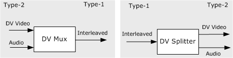

# Type-1 vs. Type-2 DV AVI Files

\[The feature associated with this page, [DirectShow](/windows/win32/directshow/directshow), is a legacy feature. It has been superseded by [MediaPlayer](/uwp/api/Windows.Media.Playback.MediaPlayer), [IMFMediaEngine](/windows/win32/api/mfmediaengine/nn-mfmediaengine-imfmediaengine), and [Audio/Video Capture in Media Foundation](windows/win32/medfound/audio-video-capture-in-media-foundation). Those features have been optimized for Windows 10 and Windows 11. Microsoft strongly recommends that new code use **MediaPlayer**, **IMFMediaEngine** and **Audio/Video Capture in Media Foundation** instead of **DirectShow**, when possible. Microsoft suggests that existing code that uses the legacy APIs be rewritten to use the new APIs if possible.\]

DV cameras produce interleaved audio-video; each frame of video also contains the audio information. If you save DV data to an AVI file, you have a choice:

-   Store the interleaved data as one stream in the AVI file. This is known as a type-1 file.
-   Split the interleaved data into separate audio and video streams. This is known as a type-2 file.

For video capture, where maximum throughput is crucial, it is better to use a type-1 file, because type-2 files carry redundant audio data. (The video stream still has the audio data. The audio is simply hidden by labeling the stream as video.) Also, writing a type-2 file requires some additional processor time to split the interleaved stream.

On the other hand, type-1 files are less efficient for real-time editing. The application must extract the audio from the interleaved stream, make the edits, and interleave the data again. Also, the type-1 format is not compatible with Microsoft® Video for Windows® (VFW). DirectShow can handle both types of files.

A type-2 file can be converted to type-1 using the [DV Muxer](dv-muxer-filter.md) filter. A type-1 file can be converted to type-2 using the [DV Splitter](dv-splitter-filter.md) filter. The following diagram illustrates the difference between the two formats.

## Related topics

<dl> <dt>

[Digital Video in DirectShow](digital-video-in-directshow.md)
</dt> <dt>

[DV Data in the AVI File Format](dv-data-in-the-avi-file-format.md)
</dt> </dl>

 

 

