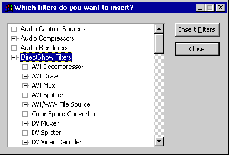
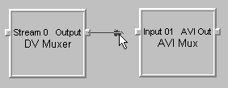

# Using GraphEdit

\[The feature associated with this page, [DirectShow](/windows/win32/directshow/directshow), is a legacy feature. It has been superseded by [MediaPlayer](/uwp/api/Windows.Media.Playback.MediaPlayer) and [IMFMediaEngine](/windows/win32/api/mfmediaengine/nn-mfmediaengine-imfmediaengine). **MediaPlayer** and **IMFMediaEngine** have been optimized for Windows 10 and Windows 11. Microsoft strongly recommends that new code use **MediaPlayer** and **IMFMediaEngine** instead of **DirectShow**, when possible. Microsoft suggests that existing code that uses the legacy APIs be rewritten to use the new APIs if possible.\]

GraphEdit is available in the Microsoft Windows Software Development Kit (SDK) (<https://go.microsoft.com/fwlink/p/?linkid=62332>).

The name of the GraphEdit application is "graphedt.exe". After you install the SDK, "graphedt.exe" is located in the following directory: \\Program Files (x86)\\Windows Kits\\10\\bin\\\<sdk version\>\\x64\\.

Before running GraphEdit, use the regsvr32 utility to register the following DLLs, which are located in the same directory:

-   proppage.dll
-   evrprop.dll

These DLLs enable GraphEdit to display property pages for some of the built-in DirectShow filters.

## Build a File Playback Graph

GraphEdit can build a filter graph for file playback. This feature is equivalent to calling the [**IGraphBuilder::RenderFile**](/windows/desktop/api/Strmif/nf-strmif-igraphbuilder-renderfile) method in an application. From the **File** menu, click **Render Media File**. GraphEdit displays an **Open File** dialog box. Select a multimedia file and click **Open**. GraphEdit builds a filter graph to play the file you've selected.

You can also render a media file located at a URL. From the **File** menu, click **Render URL**. GraphEdit displays a dialog box in which to type the URL.

## Build a Filter Graph

GraphEdit can build a custom filter graph, using any of the filters registered on your system. From the **Graph** menu, click **Insert Filters**. A dialog box appears with a list of the filters on your system, organized by filter category. GraphEdit builds this list from information in the registry. The following illustration shows the dialog box.

To add a filter to the graph, select the name of the filter and click the **Insert Filters** button, or double-click the filter name. After you have added the filters, you can connect two filters by dragging the mouse from one filter's output pin to another filter's input pin. If the pins accept the connection, GraphEdit draws an arrow connecting them.

## Run the Graph

Once you have built a filter graph in Graph Edit, you can run the graph to see whether it works as you expect. The **Graph** menu contains the menu commands **Play**, **Pause**, and **Stop**. These commands invoke to the [**IMediaControl**](/windows/desktop/api/Control/nn-control-imediacontrol) methods [**Run**](/windows/desktop/api/Control/nf-control-imediacontrol-run), [**Pause**](/windows/desktop/api/Control/nf-control-imediacontrol-pause), and [**Stop**](/windows/desktop/api/Control/nf-control-imediacontrol-stop), respectively. The GraphEdit toolbar has buttons for these commands, as well:

> [!Note]  
> The GraphEdit **Stop** command first pauses the graph and seeks to time zero (assuming the graph is seekable). For file playback, this action resets the video window to the first frame. Then GraphEdit calls [**IMediaControl::Stop**](/windows/desktop/api/Control/nf-control-imediacontrol-stop).

 

If the graph is seekable, you can seek it by dragging the slider bar that appears below the toolbar. Dragging the slider bar invokes the [**IMediaSeeking::SetPositions**](/windows/desktop/api/Strmif/nf-strmif-imediaseeking-setpositions) method.

## View Property Pages

Some filters support custom property pages, which provide a user interface for setting properties on the filter. To view a filter's property page in GraphEdit, right-click the filter and select **Properties** from the pop-up window. GraphEdit displays a property page that contains the property sheets defined by the filter (if any). In addition, GraphEdit includes a property sheet for each pin on the filter. The pin property sheets are defined by GraphEdit, not by the filter. If the pin is connected, the pin property sheet displays the media type for the connection. Otherwise, it lists the pin's preferred media types.

> [!Note]  
> To use GraphEdit's built-in property pages, you must register proppage.dll. This DLL is available in the Windows SDK. The DLL also contains additional property pages for some DirectShow filters. These property pages are provided for debugging purposes only.

 

## Related topics

<dl> <dt>

[Simulating Graph Building with GraphEdit](simulating-graph-building-with-graphedit.md)
</dt> </dl>

 

 

