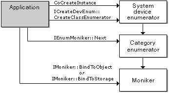

# Using the System Device Enumerator

\[The feature associated with this page, [DirectShow](/windows/win32/directshow/directshow), is a legacy feature. It has been superseded by [MediaPlayer](/uwp/api/Windows.Media.Playback.MediaPlayer), [IMFMediaEngine](/windows/win32/api/mfmediaengine/nn-mfmediaengine-imfmediaengine), and [Audio/Video Capture in Media Foundation](windows/win32/medfound/audio-video-capture-in-media-foundation). Those features have been optimized for Windows 10 and Windows 11. Microsoft strongly recommends that new code use **MediaPlayer**, **IMFMediaEngine** and **Audio/Video Capture in Media Foundation** instead of **DirectShow**, when possible. Microsoft suggests that existing code that uses the legacy APIs be rewritten to use the new APIs if possible.\]

The System Device Enumerator provides a uniform way to enumerate, by category, the filters registered on a user's system. Moreover, it differentiates between individual hardware devices, even if the same filter supports them. This is particularly useful for devices that use the Windows Driver Model (WDM) and the KSProxy filter. For example, the user might have several WDM video capture devices, all supported by the same filter. The System Device Enumerator treats them as separate device instances.

The System Device Enumerator works by creating an enumerator for a specific category, such as audio capture or video compression. The category enumerator returns a unique moniker for each device in the category. The category enumerator automatically includes any relevant Plug and Play devices in the category. For a list of categories, see [Filter Categories](filter-categories.md).

To use the System Device Enumerator, do the following:

1.  Create the system device enumerator by calling **CoCreateInstance**. The class identifier (CLSID) is CLSID\_SystemDeviceEnum.
2.  Obtain a category enumerator by calling [**ICreateDevEnum::CreateClassEnumerator**](/windows/desktop/api/Strmif/nf-strmif-icreatedevenum-createclassenumerator) with the CLSID of the desired category. This method returns an **IEnumMoniker** interface pointer. If the category is empty (or does not exist), the method returns S\_FALSE rather than an error code. If so, the returned **IEnumMoniker** pointer is **NULL** and dereferencing it will cause an exception. Therefore, explicitly test for S\_OK when you call **CreateClassEnumerator**, instead of calling the usual **SUCCEEDED** macro.
3.  Use the **IEnumMoniker::Next** method to enumerate each moniker. This method returns an **IMoniker** interface pointer. When the **Next** method reaches the end of the enumeration, it also returns S\_FALSE, so again check for S\_OK.
4.  To retrieve the friendly name of the device (for example, to display in the user interface), call the **IMoniker::BindToStorage** method.
5.  To create and initialize the DirectShow filter that manages the device, call **IMoniker::BindToObject** on the moniker. Call [**IFilterGraph::AddFilter**](/windows/desktop/api/Strmif/nf-strmif-ifiltergraph-addfilter) to add the filter to the graph.

The following diagram illustrates this process.



The following example shows how to enumerate the video compressors installed on the user's system. For brevity, the example performs minimal error checking.


```C++
// Create the System Device Enumerator.
HRESULT hr;
ICreateDevEnum *pSysDevEnum = NULL;
hr = CoCreateInstance(CLSID_SystemDeviceEnum, NULL, CLSCTX_INPROC_SERVER,
    IID_ICreateDevEnum, (void **)&pSysDevEnum);
if (FAILED(hr))
{
    return hr;
}

// Obtain a class enumerator for the video compressor category.
IEnumMoniker *pEnumCat = NULL;
hr = pSysDevEnum->CreateClassEnumerator(CLSID_VideoCompressorCategory, &pEnumCat, 0);

if (hr == S_OK) 
{
    // Enumerate the monikers.
    IMoniker *pMoniker = NULL;
    ULONG cFetched;
    while(pEnumCat->Next(1, &pMoniker, &cFetched) == S_OK)
    {
        IPropertyBag *pPropBag;
        hr = pMoniker->BindToStorage(0, 0, IID_IPropertyBag, 
            (void **)&pPropBag);
        if (SUCCEEDED(hr))
        {
            // To retrieve the filter's friendly name, do the following:
            VARIANT varName;
            VariantInit(&varName);
            hr = pPropBag->Read(L"FriendlyName", &varName, 0);
            if (SUCCEEDED(hr))
            {
                // Display the name in your UI somehow.
            }
            VariantClear(&varName);

            // To create an instance of the filter, do the following:
            IBaseFilter *pFilter;
            hr = pMoniker->BindToObject(NULL, NULL, IID_IBaseFilter,
                (void**)&pFilter);
            // Now add the filter to the graph. 
            //Remember to release pFilter later.
            pPropBag->Release();
        }
        pMoniker->Release();
    }
    pEnumCat->Release();
}
pSysDevEnum->Release();
```


**Device Monikers**

For device monikers, you can pass the moniker to the [**IFilterGraph2::AddSourceFilterForMoniker**](/windows/desktop/api/Strmif/nf-strmif-ifiltergraph2-addsourcefilterformoniker) method to create a capture filter for the device. For example code, see the documentation for that method.

The **IMoniker::GetDisplayName** method returns the display name of the moniker. Although the display name is readable, you would not typically display it to an end-user. Get the friendly name from the property bag instead, as described previously.

The **IMoniker::ParseDisplayName** method or the **MkParseDisplayName** function can be used to create a default device moniker for a given filter category. Use a display name with the form `@device:*:{category-clsid}`, where `category-clsid` is the string representation of the category GUID. The default moniker is the first moniker returned by the device enumerator for that category.

 

 


