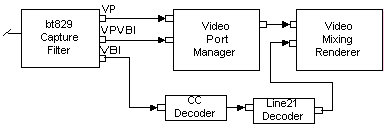

# Video Port Manager

\[The feature associated with this page, [DirectShow](/windows/win32/directshow/directshow), is a legacy feature. It has been superseded by [MediaPlayer](/uwp/api/Windows.Media.Playback.MediaPlayer), [IMFMediaEngine](/windows/win32/api/mfmediaengine/nn-mfmediaengine-imfmediaengine), and [Audio/Video Capture in Media Foundation](/windows/win32/medfound/audio-video-capture-in-media-foundation). Those features have been optimized for Windows 10 and Windows 11. Microsoft strongly recommends that new code use **MediaPlayer**, **IMFMediaEngine** and **Audio/Video Capture in Media Foundation** instead of **DirectShow**, when possible. Microsoft suggests that existing code that uses the legacy APIs be rewritten to use the new APIs if possible.\]

The Video Port Manager filter (VPM) enables the Video Mixing Renderer Filter 7 (VMR-7) to work with video capture devices or hardware decoders that use a video port. A video port is a direct hardware connection to the graphics chip. It enables video to be transferred directly to the graphics chip without going over the system bus.

> [!Note]  
> The Video Port Manager is not compatible with the VMR-9, because the VMR-9 does not support video ports.

 

| Label | Value |
|------------------------------------------|----------------------------------------------------------------------------------------------------------------------------------------------------------------------------------------------------------------------|
| Filter Interfaces                        | [**IAMVideoDecimationProperties**](/windows/desktop/api/Strmif/nn-strmif-iamvideodecimationproperties), [**IBaseFilter**](/windows/desktop/api/Strmif/nn-strmif-ibasefilter), [**IKsPropertySet**](ikspropertyset.md), [**IQualProp**](/previous-versions/windows/desktop/api/Amvideo/nn-amvideo-iqualprop), [**IVPManager**](/windows/desktop/api/Strmif/nn-strmif-ivpmanager) |
| Input Pin Media Types                    | MEDIATYPE\_Video, MEDIASUBTYPE\_VPVideo or MEDIASUBTYPE\_VPVBI, FORMAT\_None                                                                                                                                         |
| Input Pin Interfaces                     | [**IKsPin**](ikspin.md), [**IKsPropertySet**](ikspropertyset.md), [**IMemInputPin**](/windows/desktop/api/Strmif/nn-strmif-imeminputpin), [**IPin**](/windows/desktop/api/Strmif/nn-strmif-ipin), [**IPinConnection**](/windows/desktop/api/Strmif/nn-strmif-ipinconnection), [**IQualityControl**](/windows/desktop/api/Strmif/nn-strmif-iqualitycontrol) |
| Output Pin Media Types                   | MEDIATYPE\_Video, FORMAT\_VideoInfo2                                                                                                                                                                                 |
| Output Pin Interfaces                    | [**IPin**](/windows/desktop/api/Strmif/nn-strmif-ipin), [**IQualityControl**](/windows/desktop/api/Strmif/nn-strmif-iqualitycontrol)                                                                                                                                                     |
| Filter CLSID                             | CLSID\_VideoPortManager                                                                                                                                                                                              |
| [Merit](merit.md)                       | MERIT\_NORMAL                                                                                                                                                                                                        |
| [Filter Category](filter-categories.md) | CLSID\_LegacyAmFilterCategory                                                                                                                                                                                        |

 

## Remarks

The Video Port Manager combines the video port functionality of the [Overlay Mixer Filter](overlay-mixer-filter.md) and the functionality of the [VBI Surface Allocator](vbi-surface-allocator.md). The VPM allocates video ports and surfaces, and synchronizes data capture from the video port. It allows video port-based capture that is independent of rendering. If preview is desired, the VPM coordinates with the VMR-7 to display captured video port data. When a video port is present on the system, the capture filter requires additional buffers to extract VBI data from the video stream. These buffers are provided by the VPM. Once the capture filter has extracted the VBI data, it delivers it on a separate pin to filters such as the CC Decoder. The following illustration shows the VPM and its connections in a filter graph.

The DVD Graph Builder adds the VPM to the filter graph automatically when a video port is detected on the system. Once added to the graph, the VPM uses a DirectDraw object provided by the Video Mixing Renderer to allocate two or three surfaces. These surfaces receive the digitized frames from the upstream capture filter. In response to user-mode event notifications sent when data is present in the surface, the VPM performs an automatic blit to an offscreen surface provided by the VMR.

The fact that the VPM uses multiple surfaces for its input buffers means that it requires more VRAM than the previous DirectShow video port implementation. The extra blit from the VPM to the VMR-7 requires additional video memory bandwidth. And since hardware auto-flipping is not used any longer, there is a theoretical potential for dropped frames, but the empirical evidence suggests that this does not occur.

## Related topics

<dl> <dt>

[DirectShow Filters](directshow-filters.md)
</dt> <dt>

[**IVPManager Interface**](/windows/desktop/api/Strmif/nn-strmif-ivpmanager)
</dt> </dl>

 

 

